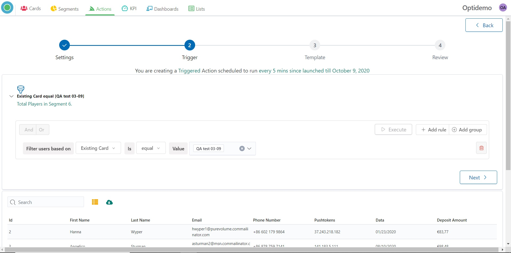
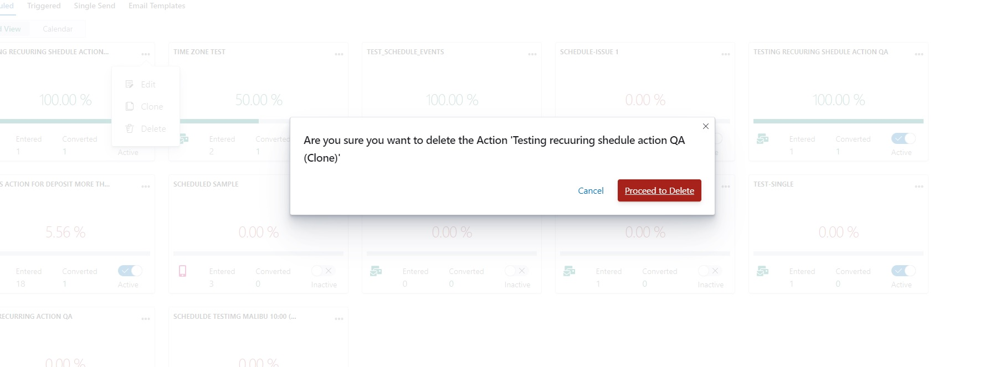
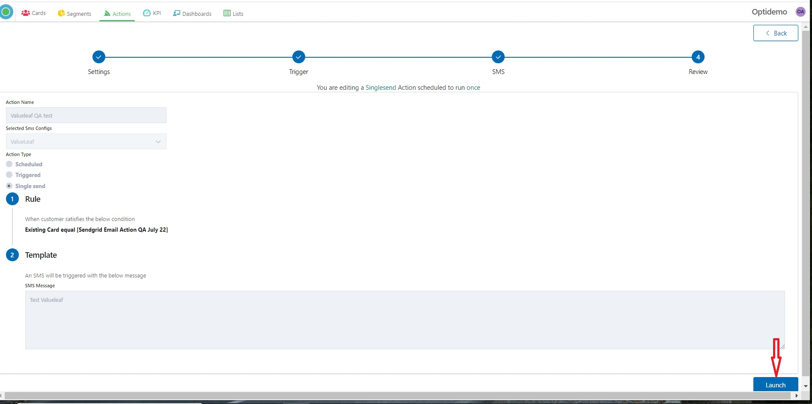
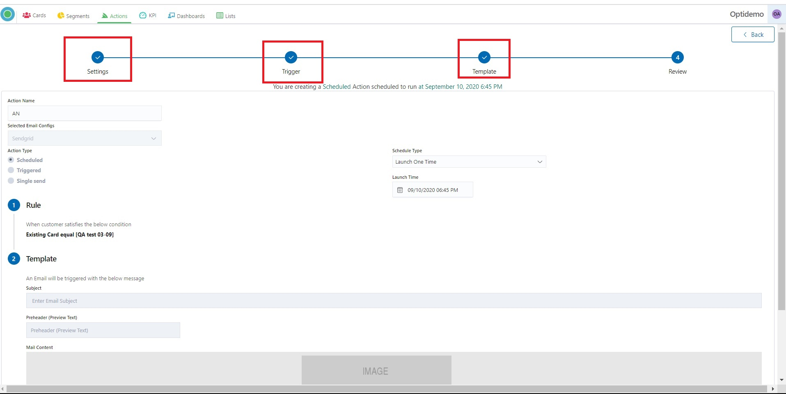

# Optikpi User Guide : Actions

* [Triggered Action](optikpi-user-guide-actions.md#actions-triggeredaction)
  * [Create Triggered Action](optikpi-user-guide-actions.md#actions-createtriggeredaction)
  * [Edit Triggered Action](optikpi-user-guide-actions.md#actions-edittriggeredaction)
  * [Clone Triggered Action](optikpi-user-guide-actions.md#actions-clonetriggeredaction)
  * [Delete Triggered Action](optikpi-user-guide-actions.md#actions-deletetriggeredaction)
* [Recurring Action](optikpi-user-guide-actions.md#actionsrecurring)
  * [Create Recurring Action](optikpi-user-guide-actions.md#actionscreaterecurring)
  * [Edit Recurring Action](optikpi-user-guide-actions.md#actions-editrecurringaction)
  * [Clone Recurring Action](optikpi-user-guide-actions.md#actions-clonerecurringaction)
  * [Delete Recurring Action](optikpi-user-guide-actions.md#actions-deleterecurringaction)
* [Single Send Action](optikpi-user-guide-actions.md#actions-singlesendaction)
  * [Create Single Send Action](optikpi-user-guide-actions.md#actions-createsinglesendaction)
  * [Edit Single Send Action](optikpi-user-guide-actions.md#actions-editsinglesendaction)
  * [Clone Single Send Action](optikpi-user-guide-actions.md#actions-clonesinglesendaction)
  * [Delete Single Send Action](optikpi-user-guide-actions.md#actions-deletesinglesendaction)
* [Email Actions](optikpi-user-guide-actions.md#actions-emailactions)
  * [Email action creation](optikpi-user-guide-actions.md#actions-emailactioncreation)
  * [Action Report](optikpi-user-guide-actions.md#actions-actionreport)
* [Push Notification](optikpi-user-guide-actions.md#actions-pushnotification)
  * [Push action creation](optikpi-user-guide-actions.md#actions-pushactioncreation)
  * [Action Report](optikpi-user-guide-actions.md#actions-actionreport.1)
* [SMS Action](optikpi-user-guide-actions.md#actions-smsaction)
  * [SMS action creation](optikpi-user-guide-actions.md#actions-smsactioncreation)
  * [Action Report](optikpi-user-guide-actions.md#actions-actionreport.2)

Optikpi enables you to set up a **triggered, recurring** or **single send** action.

**Triggered Action** scheduled to run every 5 mins since launched.

**Recuring Action** means that your Action will start and/or run according to the schedule you set by.

**Single Send Action** scheduled to run once.

Action can be executed by the following channel: **Push notification, SMS Action, Email Action, Web API**.&#x20;

## Triggered Action 

### Create Triggered Action 

There are 3 ways how you can create a new Action.

1. From a specific Card of which basis you want to create an Action.
2. From a specific Segment of which basis you want to create an Action.
3. From the main Actions screen.

The procedure of creation Actions in all cases is the same.

Optikpi enables you to setup a trigger and invokes actions for the triggers. The triggers are checked every 5 mins and actions are invoked Customers matching the trigger condition.

Triggered Action scheduled to run every 5 minutes since launched till date which you pointed.

I. Start creating a new Action by pressing the "Create New Action" button from the "Actions" - “Triggered” home screen.

 (1) (1).png>)

2\. A popup with all the list of supported Actions in Optikpi shows up. Select the type you need from the list.

.png>)

3\. Provide Action Name, End Date, and press the Next button.

Triggered Action scheduled to run every 5 minutes since launched till date which you pointed.

4\. Set Criteria you want to trigger the action: Existing Card, Existing Segments, or Existing Actions.

5\. Press the “Execute” button to see the data.

6\. Press the “Next” button to go to the next step.

7\. Create a Template of your Action.

8\. Press the “Next” button to continue.

9\. **Check Action Name, Selected Configs, Action Type, Rule, Template, Start and End Date.**

.jpg>)

10\. In the case if you need to change something you can go back to the previous steps by clicking the corresponding steps on the top.&#x20;

 (1).png>)

11\. If everything is fine click to the "Save and Launch" button - in case if you want to save and launch your campaign or "Save" in case if you want just to save one.

.jpg>)

12\. "Save and Launch" means that your campaign will be scheduled to run every 5 minutes since launched till date which you pointed.

Your Action has “Active” status and in several minutes you will see the data and Action Tracking.

.jpg>)

13\. "Save" means that your campaign will be saved with an “Inactive” status. You can change status and launch Action at any time.

.jpg>)

### Edit Triggered Action 

I. By clicking on 3 dots on the Action - Triggered panel, a popup with comes up.

2\. Click the “Edit” button for changing parameters or criteria of the Action.

3\. You can change the Filter setting and rules.

4\. As well you can go through all steps of the Action creation and change it.

5\. At the end click to the "Save and Launch" button - in case if you want to save and re-launch your campaign or "Save" in case if you want just to save one.

.jpg>)

6\. "Save and Launch" means that your campaign will be scheduled to run every 5 minutes since re-launched till date which you pointed.

Your Action has “Active” status and in several minutes you will see the data and Action Tracking.

.jpg>)

7\. "Save" means that your campaign will be saved with an “Inactive” status. You can change status and launch Action at any time.

.jpg>)

### Clone Triggered Action 

Optikpi has a "clone" feature which allows you to create absolutely the same tool with the same setting criteria and database.

I. To clone Triggered Action click on 3 dots on the Action - Triggered panel and a popup with come up.

2\. Press the “Next” button to continue.

3\. You can change Template or go ahead.

4\. Click to the "Save and Launch" button - in case if you want to save and launch your campaign or "Save" in case if you want just to save one.

.jpg>)

5\. "Save and Launch" means that your campaign will be scheduled to run every 5 minutes since launched till date which you pointed.

Your Action has “Active” status and in several minutes you will see the data and Action Tracking.

.jpg>)

6\. "Save" means that your campaign will be saved with an “Inactive” status. You can change status and launch Action at any time.

.jpg>)

### Delete Triggered Action 

By Clicking on 3 dots on the Action panel, a popup with comes up.

The “Proceed to Delete” button allows to delete Actions.

## &#x20;

* [Triggered Action](optikpi-user-guide-actions.md#actions-triggeredaction)
  * [Create Triggered Action](optikpi-user-guide-actions.md#actions-createtriggeredaction)
  * [Edit Triggered Action](optikpi-user-guide-actions.md#actions-edittriggeredaction)
  * [Clone Triggered Action](optikpi-user-guide-actions.md#actions-clonetriggeredaction)
  * [Delete Triggered Action](optikpi-user-guide-actions.md#actions-deletetriggeredaction)
* [Recurring Action](optikpi-user-guide-actions.md#actionsrecurring-1)
  * [Create Recurring Action](optikpi-user-guide-actions.md#actionsrecurring-1)
  * [Edit Recurring Action](optikpi-user-guide-actions.md#actions-editrecurringaction)
  * [Clone Recurring Action](optikpi-user-guide-actions.md#actions-clonerecurringaction)
  * [Delete Recurring Action](optikpi-user-guide-actions.md#actions-deleterecurringaction)
* [Single Send Action](optikpi-user-guide-actions.md#actions-singlesendaction)
  * [Create Single Send Action](optikpi-user-guide-actions.md#actions-createsinglesendaction)
  * [Edit Single Send Action](optikpi-user-guide-actions.md#actions-editsinglesendaction)
  * [Clone Single Send Action](optikpi-user-guide-actions.md#actions-clonesinglesendaction)
  * [Delete Single Send Action](optikpi-user-guide-actions.md#actions-deletesinglesendaction)
* [Email Actions](optikpi-user-guide-actions.md#actions-emailactions)
  * [Email action creation](optikpi-user-guide-actions.md#actions-emailactioncreation)
  * [Action Report](optikpi-user-guide-actions.md#actions-actionreport)
* [Push Notification](optikpi-user-guide-actions.md#actions-pushnotification)
  * [Push action creation](optikpi-user-guide-actions.md#actions-pushactioncreation)
  * [Action Report](optikpi-user-guide-actions.md#actions-actionreport.1)
* [SMS Action](optikpi-user-guide-actions.md#actions-smsaction)
  * [SMS action creation](optikpi-user-guide-actions.md#actions-smsactioncreation)
  * [Action Report](optikpi-user-guide-actions.md#actions-actionreport.2)

## Recurring Action 

### Create Recurring Action 

**This tutorial video will help you to Create a Launch One Time Scheduled Email Action**

[https://www.youtube.com/watch?v=ktb\_\_NV3Y1Y](https://www.youtube.com/watch?v=ktb\_\_NV3Y1Y)

There are 3 ways how you can create a new Action.

1. From a specific Card of which basis you want to create an Action.
2. From a specific Segment of which basis you want to create an Action.
3. From the main Actions screen.

The procedure of creation Actions in all cases is the same.

Recurring Action means that your Action will start and/or run according to the schedule you set by.

Recurring Action can be scheduled up to 1 hour in advance.

I. Start creating a new Action by pressing the "Create New Action" button from the "Actions"- ”Scheduled” home screen.

.jpg>)

2\. A popup with all the list of supported Actions in Optikpi shows up. Select the type you need from the list.

.jpg>)

3\. Provide Action’s name

4\. Choose Scheduled Type.

**Launch One Time** means that your Action can be Launch just 1 time.

Set the Timestamp, for example, today in 1 hour or any other day at any time.

Scheduled Action can be scheduled up to 1 hour in advance.

5\. Or you can choose “**Recurring Scheduled**” as a Scheduled type.

<figure><figcaption></figcaption></figure>

There are two **schedule types** available:&#x20;

**One Time** – Action will be sent once to the User, it will trigger next time only for new-come users.\
**Many Times** – Action can be sent many times to all users from the Segment.

Press "Yes" if you confirm Many Times sending.

<figure><figcaption></figcaption></figure>

Set Start and End Date of your Action.

<figure><figcaption></figcaption></figure>

At the Launch Time Box change the Schedule.

<figure><figcaption></figcaption></figure>

Scheduled Action can be scheduled up to 1 hour in advance.

<figure><figcaption></figcaption></figure>

6\. Closing Scheduler, click the “Next” button to continue.

<figure><figcaption></figcaption></figure>

7\. Set Criteria you want to trigger the action: Existing Card, Existing Segments, or Existing Actions.

<figure><figcaption></figcaption></figure>

8\. Press the “Execute” button to see the data.

<figure><figcaption></figcaption></figure>

9\. Press the “Next” button to go to the next step.

<figure><figcaption></figcaption></figure>

10\. Create a Template of your Action.

<figure><figcaption></figcaption></figure>

11\. Press the “Next” button to continue.

<figure><figcaption></figcaption></figure>

12\. **Check Action Name, Selected Configs, Action Type, Rule, Template, Start and End Date.**

<figure><figcaption></figcaption></figure>

13\. In the case if you need to change something you can go back to the previous steps by clicking the corresponding steps on the top.

<figure><figcaption></figcaption></figure>

14\. If everything is fine click to the "Save and Launch" button - in case if you want to save and launch your campaign or "Save" in case if you want just to save one.

<figure><figcaption></figcaption></figure>

15\. "Save and Launch" means that your campaign will be scheduled to run since launched till date which you pointed. **** Your Action has “Active” status.

<figure><figcaption></figcaption></figure>

16\. "Save" means that your campaign will be saved with an “Inactive” status. You can change status and launch Action at any time.

.jpg>)

### Edit Recurring Action 

I. By clicking on 3 dots on the Action - Scheduled panel, a popup with comes up.

2\. Click the “Edit” button for changing parameters or criteria of the Action.

3\. You can change the Filter setting and rules.

4\. As well you can go through all steps and change it.

.jpg>)

5\. At the end click to the "Save and Launch" button - in case if you want to save and re-launch your campaign or "Save" in case if you want just to save one.

.jpg>)

6\. "Save and Launch" means that your campaign will be re-scheduled to run every 5 minutes since launched till date which you pointed.

Your Action has “Active” status and in several minutes you will see the data and Action Tracking.

.jpg>)

7\. "Save" means that your campaign will be saved with an “Inactive” status. You can change status and launch Action at any time.

.jpg>)

### Clone Recurring Action 

Optikpi has a "clone" feature which allows you to create absolutely the same tool with the same setting criteria and database.

I. To clone Recurring Action click on 3 dots on the Action - Scheduled panel and a popup with comes up.

2\. Press the “Next” button to continue.

.jpg>)

3\. You can change Template or go ahead.

4\. Click to the "Save and Launch" button - in case if you want to save and launch your campaign or "Save" in case if you want just to save one.

5\. "Save and Launch" means that your campaign will be re-scheduled to run every 5 minutes since launched till date which you pointed.

Your Action has “Active” status and in several minutes you will see the data and Action Tracking.

### Delete Recurring Action 

By Clicking on 3 dots on the Action panel, a popup with comes up.

The “Proceed to Delete” button allows to delete Actions.

* [Triggered Action](optikpi-user-guide-actions.md#actions-triggeredaction)
  * [Create Triggered Action](optikpi-user-guide-actions.md#actions-createtriggeredaction)
  * [Edit Triggered Action](optikpi-user-guide-actions.md#actions-edittriggeredaction)
  * [Clone Triggered Action](optikpi-user-guide-actions.md#actions-clonetriggeredaction)
  * [Delete Triggered Action](optikpi-user-guide-actions.md#actions-deletetriggeredaction)
* [Recurring Action](optikpi-user-guide-actions.md#actionsrecurring)
  * [Create Recurring Action](optikpi-user-guide-actions.md#actionscreaterecurring)
  * [Edit Recurring Action](optikpi-user-guide-actions.md#actions-editrecurringaction)
  * [Clone Recurring Action](optikpi-user-guide-actions.md#actions-clonerecurringaction)
  * [Delete Recurring Action](optikpi-user-guide-actions.md#actions-deleterecurringaction)
* [Single Send Action](optikpi-user-guide-actions.md#actions-singlesendaction)
  * [Create Single Send Action](optikpi-user-guide-actions.md#actions-createsinglesendaction)
  * [Edit Single Send Action](optikpi-user-guide-actions.md#actions-editsinglesendaction)
  * [Clone Single Send Action](optikpi-user-guide-actions.md#actions-clonesinglesendaction)
  * [Delete Single Send Action](optikpi-user-guide-actions.md#actions-deletesinglesendaction)
* [Email Actions](optikpi-user-guide-actions.md#actions-emailactions)
  * [Email action creation](optikpi-user-guide-actions.md#actions-emailactioncreation)
  * [Action Report](optikpi-user-guide-actions.md#actions-actionreport)
* [Push Notification](optikpi-user-guide-actions.md#actions-pushnotification)
  * [Push action creation](optikpi-user-guide-actions.md#actions-pushactioncreation)
  * [Action Report](optikpi-user-guide-actions.md#actions-actionreport.1)
* [SMS Action](optikpi-user-guide-actions.md#actions-smsaction)
  * [SMS action creation](optikpi-user-guide-actions.md#actions-smsactioncreation)
  * [Action Report](optikpi-user-guide-actions.md#actions-actionreport.2)

## Single Send Action 

### Create Single Send Action 

There are 3 ways how you can create a new Action.

1. From a specific Card of which basis you want to create an Action.
2. From a specific Segment of which basis you want to create an Action.
3. From the main Actions screen.

The procedure of creation Actions in all cases is the same.

Optikpi Single Send feature enables you to start your actions immediately.

There is no time gap between the moment of creation the Action and the moment of starting one.

But your Action will proceed just 1 time.

I. Start creating a new Action by pressing the "Create New Action" button from the "Actions" - “Single Send” home screen.

2\. A popup with all the list of supported Actions in Optikpi shows up. Select the type you need from the list.

.jpg>)

3\. Provide Action’s name and press the “Next” button to continue.

There is no time gap between the moment of creation the Action and the moment of starting one.

But your Action will proceed just 1 time.

4\. Set Criteria you want to trigger the action: Existing Card, Existing Segments, or ExistingActions.

5\. Press the “Execute” button to see the data.

6\. Press the “Next” button to go to the next step.

7\. Create a Template of your Action.

 (2).png>)

8\. Press the “Next” button to continue.

10\. **Check Action Name, Selected Configs, Action Type, Rule, Template.**

11\. In the case if you need to change something you can go back to the previous steps by clicking the corresponding steps on the top.

.jpg>)

12\. If everything is fine click to the "Launch" button.

13\. Your campaign will start immediately.

.png>)

* [Triggered Action](optikpi-user-guide-actions.md#Actions-TriggeredAction)
  * [Create Triggered Action](optikpi-user-guide-actions.md#Actions-CreateTriggeredAction)
  * [Edit Triggered Action](optikpi-user-guide-actions.md#Actions-EditTriggeredAction)
  * [Clone Triggered Action](optikpi-user-guide-actions.md#Actions-CloneTriggeredAction)
  * [Delete Triggered Action](optikpi-user-guide-actions.md#Actions-DeleteTriggeredAction)
* [Recurring Action](optikpi-user-guide-actions.md#Actions-RecurringAction)
  * [Create Recurring Action](optikpi-user-guide-actions.md#Actions-CreateRecurringAction)
  * [Edit Recurring Action](optikpi-user-guide-actions.md#Actions-EditRecurringAction)
  * [Clone Recurring Action](optikpi-user-guide-actions.md#Actions-CloneRecurringAction)
  * [Delete Recurring Action](optikpi-user-guide-actions.md#Actions-DeleteRecurringAction)
* [Single Send Action](optikpi-user-guide-actions.md#Actions-SingleSendAction)
  * [Create Single Send Action](optikpi-user-guide-actions.md#Actions-CreateSingleSendAction)
  * [Edit Single Send Action](optikpi-user-guide-actions.md#Actions-EditSingleSendAction)
  * [Clone Single Send Action](optikpi-user-guide-actions.md#Actions-CloneSingleSendAction)
  * [Delete Single Send Action](optikpi-user-guide-actions.md#Actions-DeleteSingleSendAction)
* [Email Actions](optikpi-user-guide-actions.md#Actions-EmailActions)
  * [Email action creation](optikpi-user-guide-actions.md#Actions-Emailactioncreation)
  * [Action Report](optikpi-user-guide-actions.md#Actions-ActionReport)
* [Push Notification](optikpi-user-guide-actions.md#Actions-PushNotification)
  * [Push action creation](optikpi-user-guide-actions.md#Actions-Pushactioncreation)
  * [Action Report](optikpi-user-guide-actions.md#Actions-ActionReport.1)
* [SMS Action](optikpi-user-guide-actions.md#Actions-SMSAction)
  * [SMS action creation](optikpi-user-guide-actions.md#Actions-SMSactioncreation)
  * [Action Report](optikpi-user-guide-actions.md#Actions-ActionReport.2)

### Edit Single Send Action 

I. By clicking on 3 dots on the Action - Single Send panel, a popup with comes up.

2\. Click the “Edit” button for changing parameters or criteria of the Action.

3\. You can change the Filter setting and rules.

4\. As well you can go through all steps and change it.

5\. Press the “Launch” button for re-launching your Action.

* [Triggered Action](optikpi-user-guide-actions.md#Actions-TriggeredAction)
  * [Create Triggered Action](optikpi-user-guide-actions.md#Actions-CreateTriggeredAction)
  * [Edit Triggered Action](optikpi-user-guide-actions.md#Actions-EditTriggeredAction)
  * [Clone Triggered Action](optikpi-user-guide-actions.md#Actions-CloneTriggeredAction)
  * [Delete Triggered Action](optikpi-user-guide-actions.md#Actions-DeleteTriggeredAction)
* [Recurring Action](optikpi-user-guide-actions.md#Actions-RecurringAction)
  * [Create Recurring Action](optikpi-user-guide-actions.md#Actions-CreateRecurringAction)
  * [Edit Recurring Action](optikpi-user-guide-actions.md#Actions-EditRecurringAction)
  * [Clone Recurring Action](optikpi-user-guide-actions.md#Actions-CloneRecurringAction)
  * [Delete Recurring Action](optikpi-user-guide-actions.md#Actions-DeleteRecurringAction)
* [Single Send Action](optikpi-user-guide-actions.md#Actions-SingleSendAction)
  * [Create Single Send Action](optikpi-user-guide-actions.md#Actions-CreateSingleSendAction)
  * [Edit Single Send Action](optikpi-user-guide-actions.md#Actions-EditSingleSendAction)
  * [Clone Single Send Action](optikpi-user-guide-actions.md#Actions-CloneSingleSendAction)
  * [Delete Single Send Action](optikpi-user-guide-actions.md#Actions-DeleteSingleSendAction)
* [Email Actions](optikpi-user-guide-actions.md#Actions-EmailActions)
  * [Email action creation](optikpi-user-guide-actions.md#Actions-Emailactioncreation)
  * [Action Report](optikpi-user-guide-actions.md#Actions-ActionReport)
* [Push Notification](optikpi-user-guide-actions.md#Actions-PushNotification)
  * [Push action creation](optikpi-user-guide-actions.md#Actions-Pushactioncreation)
  * [Action Report](optikpi-user-guide-actions.md#Actions-ActionReport.1)
* [SMS Action](optikpi-user-guide-actions.md#Actions-SMSAction)
  * [SMS action creation](optikpi-user-guide-actions.md#Actions-SMSactioncreation)
  * [Action Report](optikpi-user-guide-actions.md#Actions-ActionReport.2)

### Clone Single Send Action 

Optikpi has a "clone" feature which allows you to create absolutely the same tool with the same setting criteria and database.

I. To clone Single Send Action click on 3 dots on the Action - Single Send panel and a popup with come up.

2\. Press the “Next” button to continue.

3\. You can change Template or go ahead.

4\. Press the “Launch” button for launching your Action.

* [Triggered Action](optikpi-user-guide-actions.md#Actions-TriggeredAction)
  * [Create Triggered Action](optikpi-user-guide-actions.md#Actions-CreateTriggeredAction)
  * [Edit Triggered Action](optikpi-user-guide-actions.md#Actions-EditTriggeredAction)
  * [Clone Triggered Action](optikpi-user-guide-actions.md#Actions-CloneTriggeredAction)
  * [Delete Triggered Action](optikpi-user-guide-actions.md#Actions-DeleteTriggeredAction)
* [Recurring Action](optikpi-user-guide-actions.md#Actions-RecurringAction)
  * [Create Recurring Action](optikpi-user-guide-actions.md#Actions-CreateRecurringAction)
  * [Edit Recurring Action](optikpi-user-guide-actions.md#Actions-EditRecurringAction)
  * [Clone Recurring Action](optikpi-user-guide-actions.md#Actions-CloneRecurringAction)
  * [Delete Recurring Action](optikpi-user-guide-actions.md#Actions-DeleteRecurringAction)
* [Single Send Action](optikpi-user-guide-actions.md#Actions-SingleSendAction)
  * [Create Single Send Action](optikpi-user-guide-actions.md#Actions-CreateSingleSendAction)
  * [Edit Single Send Action](optikpi-user-guide-actions.md#Actions-EditSingleSendAction)
  * [Clone Single Send Action](optikpi-user-guide-actions.md#Actions-CloneSingleSendAction)
  * [Delete Single Send Action](optikpi-user-guide-actions.md#Actions-DeleteSingleSendAction)
* [Email Actions](optikpi-user-guide-actions.md#Actions-EmailActions)
  * [Email action creation](optikpi-user-guide-actions.md#Actions-Emailactioncreation)
  * [Action Report](optikpi-user-guide-actions.md#Actions-ActionReport)
* [Push Notification](optikpi-user-guide-actions.md#Actions-PushNotification)
  * [Push action creation](optikpi-user-guide-actions.md#Actions-Pushactioncreation)
  * [Action Report](optikpi-user-guide-actions.md#Actions-ActionReport.1)
* [SMS Action](optikpi-user-guide-actions.md#Actions-SMSAction)
  * [SMS action creation](optikpi-user-guide-actions.md#Actions-SMSactioncreation)
  * [Action Report](optikpi-user-guide-actions.md#Actions-ActionReport.2)

### Delete Single Send Action 

By Clicking on 3 dots on the Action panel, a popup with comes up.

The “Proceed to Delete” button allows to delete Actions.

* [Triggered Action](optikpi-user-guide-actions.md#Actions-TriggeredAction)
  * [Create Triggered Action](optikpi-user-guide-actions.md#Actions-CreateTriggeredAction)
  * [Edit Triggered Action](optikpi-user-guide-actions.md#Actions-EditTriggeredAction)
  * [Clone Triggered Action](optikpi-user-guide-actions.md#Actions-CloneTriggeredAction)
  * [Delete Triggered Action](optikpi-user-guide-actions.md#Actions-DeleteTriggeredAction)
* [Recurring Action](optikpi-user-guide-actions.md#Actions-RecurringAction)
  * [Create Recurring Action](optikpi-user-guide-actions.md#Actions-CreateRecurringAction)
  * [Edit Recurring Action](optikpi-user-guide-actions.md#Actions-EditRecurringAction)
  * [Clone Recurring Action](optikpi-user-guide-actions.md#Actions-CloneRecurringAction)
  * [Delete Recurring Action](optikpi-user-guide-actions.md#Actions-DeleteRecurringAction)
* [Single Send Action](optikpi-user-guide-actions.md#Actions-SingleSendAction)
  * [Create Single Send Action](optikpi-user-guide-actions.md#Actions-CreateSingleSendAction)
  * [Edit Single Send Action](optikpi-user-guide-actions.md#Actions-EditSingleSendAction)
  * [Clone Single Send Action](optikpi-user-guide-actions.md#Actions-CloneSingleSendAction)
  * [Delete Single Send Action](optikpi-user-guide-actions.md#Actions-DeleteSingleSendAction)
* [Email Actions](optikpi-user-guide-actions.md#Actions-EmailActions)
  * [Email action creation](optikpi-user-guide-actions.md#Actions-Emailactioncreation)
  * [Action Report](optikpi-user-guide-actions.md#Actions-ActionReport)
* [Push Notification](optikpi-user-guide-actions.md#Actions-PushNotification)
  * [Push action creation](optikpi-user-guide-actions.md#Actions-Pushactioncreation)
  * [Action Report](optikpi-user-guide-actions.md#Actions-ActionReport.1)
* [SMS Action](optikpi-user-guide-actions.md#Actions-SMSAction)
  * [SMS action creation](optikpi-user-guide-actions.md#Actions-SMSactioncreation)
  * [Action Report](optikpi-user-guide-actions.md#Actions-ActionReport.2)

## Email Actions 

Optikpi enables you to set up a **triggered, recurring** or **single send** action.

Action can be executed by the following channel:\
**Push notification** - is a message that pops up on the user's device.\
**SMS Action** - is outgoing SMS text messages to different recipients.\
**Email Action** - is an email notification, can be plain text or styled using HTML.\
**Web API** Action will be sent out based on the action definition.

**Email Action** - is an email notification, can be plain text or styled using HTML.

You can create an email notification using templates.

### Email action creation 

I. Start creating an Email Notification by pressing the "Create New Action" button From the "Actions" home screen.

.jpg>)

2\. Select an action type by choosing “Email Actions”.

.jpg>)

3\. Provide Action’s Name and take action setting according to action’s type (**triggered,** **recurring,** or **single send** action).

.jpg>)

4\. After setting criteria click the “Execute” button.

.jpg>)

5\. Select an **Email Configs** - your Email sending provider.

.jpg>)

6\. Enter email **Subject.**

.jpg>)

7\. Enter **Preheader**. (Preview Text).

A preheader is the short summary text that follows the subject line when an email is viewed in the inbox. Many mobile, desktop, and web email clients provide them to tip you off on what the email contains before you open it.

8\. Create a new Template of your mail message by clicking on the “Create New Template” button.

.jpg>)

9\. Start of creating of your Templates by clicking on blue space.

.jpg>)

10\. Drag content from the right-side panel.

.jpg>)

11\. In the text content, you can insert Merge Tags in your message.

.jpg>)

12\. Use a small black panel for preview how your Template looks on different devices.

.jpg>)

13\. Press the “Next” button for the next step.

.jpg>)

14\. System will offer you to save the current Email Template. Enter the Name and press “Next”. Or “Skip Save” if you don’t need saving.

.jpg>)

15\. Check **Action Name, Selected Configs, Action Type, Rule, Template, Start and End Date.**

.jpg>)

16\. In the case if you need to change something you can go back to the previous steps by clicking the corresponding steps on the top.

17\. If everything is fine click to the "Save and Launch" button - in case if you want to save and launch your campaign or "Save" in case if you want just to save one.

18\. "Save and Launch" means that your campaign will be started according to your settings. Your Action has “Active” status and in several minutes you will see the data and Action Tracking.

.jpg>)

19\. "Save" means that your campaign will be saved with an “Inactive” status. You can change status and launch Action at any time.

* [Triggered Action](optikpi-user-guide-actions.md#Actions-TriggeredAction)
  * [Create Triggered Action](optikpi-user-guide-actions.md#Actions-CreateTriggeredAction)
  * [Edit Triggered Action](optikpi-user-guide-actions.md#Actions-EditTriggeredAction)
  * [Clone Triggered Action](optikpi-user-guide-actions.md#Actions-CloneTriggeredAction)
  * [Delete Triggered Action](optikpi-user-guide-actions.md#Actions-DeleteTriggeredAction)
* [Recurring Action](optikpi-user-guide-actions.md#Actions-RecurringAction)
  * [Create Recurring Action](optikpi-user-guide-actions.md#Actions-CreateRecurringAction)
  * [Edit Recurring Action](optikpi-user-guide-actions.md#Actions-EditRecurringAction)
  * [Clone Recurring Action](optikpi-user-guide-actions.md#Actions-CloneRecurringAction)
  * [Delete Recurring Action](optikpi-user-guide-actions.md#Actions-DeleteRecurringAction)
* [Single Send Action](optikpi-user-guide-actions.md#Actions-SingleSendAction)
  * [Create Single Send Action](optikpi-user-guide-actions.md#Actions-CreateSingleSendAction)
  * [Edit Single Send Action](optikpi-user-guide-actions.md#Actions-EditSingleSendAction)
  * [Clone Single Send Action](optikpi-user-guide-actions.md#Actions-CloneSingleSendAction)
  * [Delete Single Send Action](optikpi-user-guide-actions.md#Actions-DeleteSingleSendAction)
* [Email Actions](optikpi-user-guide-actions.md#Actions-EmailActions)
  * [Email action creation](optikpi-user-guide-actions.md#Actions-Emailactioncreation)
  * [Action Report](optikpi-user-guide-actions.md#Actions-ActionReport)
* [Push Notification](optikpi-user-guide-actions.md#Actions-PushNotification)
  * [Push action creation](optikpi-user-guide-actions.md#Actions-Pushactioncreation)
  * [Action Report](optikpi-user-guide-actions.md#Actions-ActionReport.1)
* [SMS Action](optikpi-user-guide-actions.md#Actions-SMSAction)
  * [SMS action creation](optikpi-user-guide-actions.md#Actions-SMSactioncreation)
  * [Action Report](optikpi-user-guide-actions.md#Actions-ActionReport.2)

### Action Report 

Optikpi provides the possibility to explore the performance of your Actions.

I. Start from the Actions main screen.

2\. Click on the Action which you want to explore.

3\. You can see card and list name; delivery report; conversion chart.

On the up right side there are tools for activating/deactivate, editing and cloning.

In the Action tracking part you find possibility for column setting and downloading data in CSV format.

&#x20;

* [Triggered Action](optikpi-user-guide-actions.md#Actions-TriggeredAction)
  * [Create Triggered Action](optikpi-user-guide-actions.md#Actions-CreateTriggeredAction)
  * [Edit Triggered Action](optikpi-user-guide-actions.md#Actions-EditTriggeredAction)
  * [Clone Triggered Action](optikpi-user-guide-actions.md#Actions-CloneTriggeredAction)
  * [Delete Triggered Action](optikpi-user-guide-actions.md#Actions-DeleteTriggeredAction)
* [Recurring Action](optikpi-user-guide-actions.md#Actions-RecurringAction)
  * [Create Recurring Action](optikpi-user-guide-actions.md#Actions-CreateRecurringAction)
  * [Edit Recurring Action](optikpi-user-guide-actions.md#Actions-EditRecurringAction)
  * [Clone Recurring Action](optikpi-user-guide-actions.md#Actions-CloneRecurringAction)
  * [Delete Recurring Action](optikpi-user-guide-actions.md#Actions-DeleteRecurringAction)
* [Single Send Action](optikpi-user-guide-actions.md#Actions-SingleSendAction)
  * [Create Single Send Action](optikpi-user-guide-actions.md#Actions-CreateSingleSendAction)
  * [Edit Single Send Action](optikpi-user-guide-actions.md#Actions-EditSingleSendAction)
  * [Clone Single Send Action](optikpi-user-guide-actions.md#Actions-CloneSingleSendAction)
  * [Delete Single Send Action](optikpi-user-guide-actions.md#Actions-DeleteSingleSendAction)
* [Email Actions](optikpi-user-guide-actions.md#Actions-EmailActions)
  * [Email action creation](optikpi-user-guide-actions.md#Actions-Emailactioncreation)
  * [Action Report](optikpi-user-guide-actions.md#Actions-ActionReport)
* [Push Notification](optikpi-user-guide-actions.md#Actions-PushNotification)
  * [Push action creation](optikpi-user-guide-actions.md#Actions-Pushactioncreation)
  * [Action Report](optikpi-user-guide-actions.md#Actions-ActionReport.1)
* [SMS Action](optikpi-user-guide-actions.md#Actions-SMSAction)
  * [SMS action creation](optikpi-user-guide-actions.md#Actions-SMSactioncreation)
  * [Action Report](optikpi-user-guide-actions.md#Actions-ActionReport.2)

## Push Notification 

Optikpi enables you to set up a **triggered, recurring** or **single send** action.

Action can be executed by the following channel:\
**Push notification** - is a message that pops up on the user's device.\
**SMS Action** - is outgoing SMS text messages to different recipients.\
**Email Action** - is an email notification, can be plain text or styled using HTML.\
**Web API** Action will be sent out based on the action definition.

**Push notification** - is a message that pops up on the user's device.

### Push action creation 

I. Start creating a Push Notification by pressing "Create New Action" button From "Actions" home screen.

.jpg>)

2\. Select an action type by choosing “Push Notification”

3\. Provide Action’s Name and take action setting according to action’s type (**triggered,** **recurring,** or **single send** action).

4\. Set criteria and click the “Execute” button.

5\. Select a **Push Configs** - your push sending provider.

 (1).png>)

6\. Enter **Title** - name of your Action.

.png>)

7\. Choose Merger Tag.

Optikpi offers merge tags for all kinds of dynamic information. Choose a merge tag for your push message to add personalized or dynamic content.

 (1) (1).png>)

8\. Fill **Push Message field**

.png>)

9\. Optional you can add **** Image**:** Choose the Image to upload&#x20;

.png>)

then press the "Upload" button.

.png>)

10\. Fill pairs **Data Values** and press the "Add" button to continue.

.png>)

11\. In case if you need to delete pair press the x icon.

.png>)

12\.  Use the right panel to preview how your Push Notification looks on different devices.

 (2).png>)

13\. Press the “Next” button&#x20;

.png>)

and Check **Action Name, Selected Configs, Action Type, Rule, Template, Start and End Date.**

.png>)

14\. In the case if you need to change something you can go back to the previous steps by clicking the corresponding steps on the top.

.png>)

15\. If everything is fine click to the "Save and Launch" button - in case if you want to save and launch your campaign or "Save" in case if you want just to save one.

.png>)

16\. "Save and Launch" means that your campaign will be scheduled to run every 5 minutes since launched till date which you pointed.

Your Action has “Active” status and in several minutes you will see the data and Action Tracking.

.png>)

17\.  "Save" means that your campaign will be saved with an “Inactive” status. You can change status and launch Action at any time.

 (1) (1).png>)

* [Triggered Action](optikpi-user-guide-actions.md#Actions-TriggeredAction)
  * [Create Triggered Action](optikpi-user-guide-actions.md#Actions-CreateTriggeredAction)
  * [Edit Triggered Action](optikpi-user-guide-actions.md#Actions-EditTriggeredAction)
  * [Clone Triggered Action](optikpi-user-guide-actions.md#Actions-CloneTriggeredAction)
  * [Delete Triggered Action](optikpi-user-guide-actions.md#Actions-DeleteTriggeredAction)
* [Recurring Action](optikpi-user-guide-actions.md#Actions-RecurringAction)
  * [Create Recurring Action](optikpi-user-guide-actions.md#Actions-CreateRecurringAction)
  * [Edit Recurring Action](optikpi-user-guide-actions.md#Actions-EditRecurringAction)
  * [Clone Recurring Action](optikpi-user-guide-actions.md#Actions-CloneRecurringAction)
  * [Delete Recurring Action](optikpi-user-guide-actions.md#Actions-DeleteRecurringAction)
* [Single Send Action](optikpi-user-guide-actions.md#Actions-SingleSendAction)
  * [Create Single Send Action](optikpi-user-guide-actions.md#Actions-CreateSingleSendAction)
  * [Edit Single Send Action](optikpi-user-guide-actions.md#Actions-EditSingleSendAction)
  * [Clone Single Send Action](optikpi-user-guide-actions.md#Actions-CloneSingleSendAction)
  * [Delete Single Send Action](optikpi-user-guide-actions.md#Actions-DeleteSingleSendAction)
* [Email Actions](optikpi-user-guide-actions.md#Actions-EmailActions)
  * [Email action creation](optikpi-user-guide-actions.md#Actions-Emailactioncreation)
  * [Action Report](optikpi-user-guide-actions.md#Actions-ActionReport)
* [Push Notification](optikpi-user-guide-actions.md#Actions-PushNotification)
  * [Push action creation](optikpi-user-guide-actions.md#Actions-Pushactioncreation)
  * [Action Report](optikpi-user-guide-actions.md#Actions-ActionReport.1)
* [SMS Action](optikpi-user-guide-actions.md#Actions-SMSAction)
  * [SMS action creation](optikpi-user-guide-actions.md#Actions-SMSactioncreation)
  * [Action Report](optikpi-user-guide-actions.md#Actions-ActionReport.2)

### Action Report 

Optikpi provides the possibility to explore the performance of your Actions.

I. Start from the Actions main screen.

2\. Click on the Action which you want to explore.

3\. You can see card and list name; delivery report; conversion chart.

On the up right side there are tools for activating/deactivate, editing and cloning.

In the Action tracking part you find possibility for column setting and downloading data in CSV format.

* [Triggered Action](optikpi-user-guide-actions.md#Actions-TriggeredAction)
  * [Create Triggered Action](optikpi-user-guide-actions.md#Actions-CreateTriggeredAction)
  * [Edit Triggered Action](optikpi-user-guide-actions.md#Actions-EditTriggeredAction)
  * [Clone Triggered Action](optikpi-user-guide-actions.md#Actions-CloneTriggeredAction)
  * [Delete Triggered Action](optikpi-user-guide-actions.md#Actions-DeleteTriggeredAction)
* [Recurring Action](optikpi-user-guide-actions.md#Actions-RecurringAction)
  * [Create Recurring Action](optikpi-user-guide-actions.md#Actions-CreateRecurringAction)
  * [Edit Recurring Action](optikpi-user-guide-actions.md#Actions-EditRecurringAction)
  * [Clone Recurring Action](optikpi-user-guide-actions.md#Actions-CloneRecurringAction)
  * [Delete Recurring Action](optikpi-user-guide-actions.md#Actions-DeleteRecurringAction)
* [Single Send Action](optikpi-user-guide-actions.md#Actions-SingleSendAction)
  * [Create Single Send Action](optikpi-user-guide-actions.md#Actions-CreateSingleSendAction)
  * [Edit Single Send Action](optikpi-user-guide-actions.md#Actions-EditSingleSendAction)
  * [Clone Single Send Action](optikpi-user-guide-actions.md#Actions-CloneSingleSendAction)
  * [Delete Single Send Action](optikpi-user-guide-actions.md#Actions-DeleteSingleSendAction)
* [Email Actions](optikpi-user-guide-actions.md#Actions-EmailActions)
  * [Email action creation](optikpi-user-guide-actions.md#Actions-Emailactioncreation)
  * [Action Report](optikpi-user-guide-actions.md#Actions-ActionReport)
* [Push Notification](optikpi-user-guide-actions.md#Actions-PushNotification)
  * [Push action creation](optikpi-user-guide-actions.md#Actions-Pushactioncreation)
  * [Action Report](optikpi-user-guide-actions.md#Actions-ActionReport.1)
* [SMS Action](optikpi-user-guide-actions.md#Actions-SMSAction)
  * [SMS action creation](optikpi-user-guide-actions.md#Actions-SMSactioncreation)
  * [Action Report](optikpi-user-guide-actions.md#Actions-ActionReport.2)

## SMS Action 

Optikpi enables you to set up a **triggered, recurring** or **single send** action.

Action can be executed by the following channel:\
**Push notification** - is a message that pops up on the user's device.\
**SMS Action** - is outgoing SMS text messages to different recipients.\
**Email Action** - is an email notification, can be plain text or styled using HTML.\
**Web API** Action will be sent out based on the action definition.

**SMS Action** - is outgoing SMS text messages to different recipients.

### SMS action creation 

I. Start creating an SMS Action by pressing the "Create New Action" button From the "Actions" home screen.

.jpg>)

2\. Select an action type by choosing “Sms Actions”.

3\. Provide Action’s Name and take action setting according to action’s type (**triggered,** **recurring,** or **single send** action).

4\. After setting criteria click the “Execute” button.

5\. Select an **SMS Configs** - your SMS provider.

6\. Type the text of your SMS-Campaign.

7\. Or choose Available SMS Templates.

8\. Press the “Next” button.

9\. Check **Action Name, Selected Sms Configs, Action Type, Rule, Template, Start and End Date.**

10\. In the case if you need change something you can go back to the previous steps by clicking the corresponding steps on the top.

11\. If everything is fine click to the "Save and Launch" button - in case if you want to save and launch your campaign or "Save" in case if you want just to save one.

12\. "Save and Launch" means that your campaign will be scheduled to run every 5 minutes since launched till date which you pointed.

Your Action has “Active” status and in several minutes you will see the data and Action Tracking.

13\. "Save" means that your campaign will be saved with an “Inactive” status. You can change status and launch Action at any time.

* [Triggered Action](optikpi-user-guide-actions.md#Actions-TriggeredAction)
  * [Create Triggered Action](optikpi-user-guide-actions.md#Actions-CreateTriggeredAction)
  * [Edit Triggered Action](optikpi-user-guide-actions.md#Actions-EditTriggeredAction)
  * [Clone Triggered Action](optikpi-user-guide-actions.md#Actions-CloneTriggeredAction)
  * [Delete Triggered Action](optikpi-user-guide-actions.md#Actions-DeleteTriggeredAction)
* [Recurring Action](optikpi-user-guide-actions.md#Actions-RecurringAction)
  * [Create Recurring Action](optikpi-user-guide-actions.md#Actions-CreateRecurringAction)
  * [Edit Recurring Action](optikpi-user-guide-actions.md#Actions-EditRecurringAction)
  * [Clone Recurring Action](optikpi-user-guide-actions.md#Actions-CloneRecurringAction)
  * [Delete Recurring Action](optikpi-user-guide-actions.md#Actions-DeleteRecurringAction)
* [Single Send Action](optikpi-user-guide-actions.md#Actions-SingleSendAction)
  * [Create Single Send Action](optikpi-user-guide-actions.md#Actions-CreateSingleSendAction)
  * [Edit Single Send Action](optikpi-user-guide-actions.md#Actions-EditSingleSendAction)
  * [Clone Single Send Action](optikpi-user-guide-actions.md#Actions-CloneSingleSendAction)
  * [Delete Single Send Action](optikpi-user-guide-actions.md#Actions-DeleteSingleSendAction)
* [Email Actions](optikpi-user-guide-actions.md#Actions-EmailActions)
  * [Email action creation](optikpi-user-guide-actions.md#Actions-Emailactioncreation)
  * [Action Report](optikpi-user-guide-actions.md#Actions-ActionReport)
* [Push Notification](optikpi-user-guide-actions.md#Actions-PushNotification)
  * [Push action creation](optikpi-user-guide-actions.md#Actions-Pushactioncreation)
  * [Action Report](optikpi-user-guide-actions.md#Actions-ActionReport.1)
* [SMS Action](optikpi-user-guide-actions.md#Actions-SMSAction)
  * [SMS action creation](optikpi-user-guide-actions.md#Actions-SMSactioncreation)
  * [Action Report](optikpi-user-guide-actions.md#Actions-ActionReport.2)

### Action Report 

Optikpi provides the possibility to explore the performance of your Actions.

I. Start from the Actions main screen.

2\. Click on the Action which you want to explore.

3\. You can see card and list name; delivery report; conversion chart.

On the up right side there are tools for activating/deactivate, editing and cloning.

In the Action tracking part you find possibility for column setting and downloading data in CSV format.

[Triggered Action](optikpi-user-guide-actions.md#Actions-TriggeredAction)

*
  * [Create Triggered Action](optikpi-user-guide-actions.md#Actions-CreateTriggeredAction)
  * [Edit Triggered Action](optikpi-user-guide-actions.md#Actions-EditTriggeredAction)
  * [Clone Triggered Action](optikpi-user-guide-actions.md#Actions-CloneTriggeredAction)
  * [Delete Triggered Action](optikpi-user-guide-actions.md#Actions-DeleteTriggeredAction)
* [Recurring Action](optikpi-user-guide-actions.md#Actions-RecurringAction)
  * [Create Recurring Action](optikpi-user-guide-actions.md#Actions-CreateRecurringAction)
  * [Edit Recurring Action](optikpi-user-guide-actions.md#Actions-EditRecurringAction)
  * [Clone Recurring Action](optikpi-user-guide-actions.md#Actions-CloneRecurringAction)
  * [Delete Recurring Action](optikpi-user-guide-actions.md#Actions-DeleteRecurringAction)
* [Single Send Action](optikpi-user-guide-actions.md#Actions-SingleSendAction)
  * [Create Single Send Action](optikpi-user-guide-actions.md#Actions-CreateSingleSendAction)
  * [Edit Single Send Action](optikpi-user-guide-actions.md#Actions-EditSingleSendAction)
  * [Clone Single Send Action](optikpi-user-guide-actions.md#Actions-CloneSingleSendAction)
  * [Delete Single Send Action](optikpi-user-guide-actions.md#Actions-DeleteSingleSendAction)
* [Email Actions](optikpi-user-guide-actions.md#Actions-EmailActions)
  * [Email action creation](optikpi-user-guide-actions.md#Actions-Emailactioncreation)
  * [Action Report](optikpi-user-guide-actions.md#Actions-ActionReport)
* [Push Notification](optikpi-user-guide-actions.md#Actions-PushNotification)
  * [Push action creation](optikpi-user-guide-actions.md#Actions-Pushactioncreation)
  * [Action Report](optikpi-user-guide-actions.md#Actions-ActionReport.1)
* [SMS Action](optikpi-user-guide-actions.md#Actions-SMSAction)
  * [SMS action creation](optikpi-user-guide-actions.md#Actions-SMSactioncreation)
  * [Action Report](optikpi-user-guide-actions.md#Actions-ActionReport.2)
