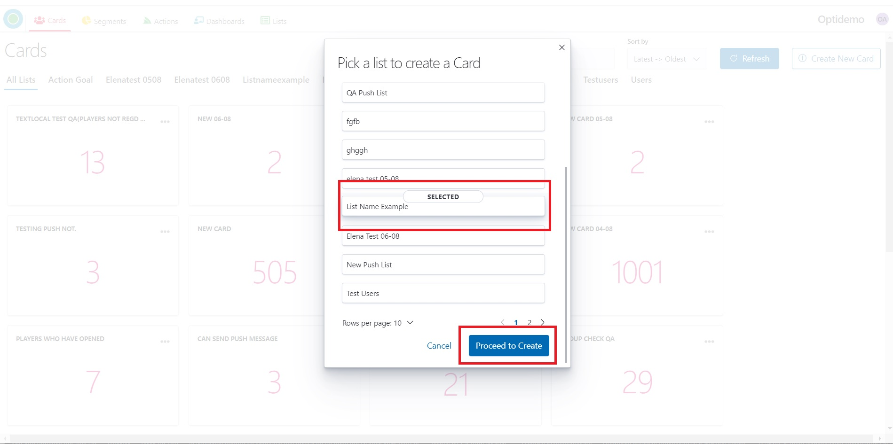
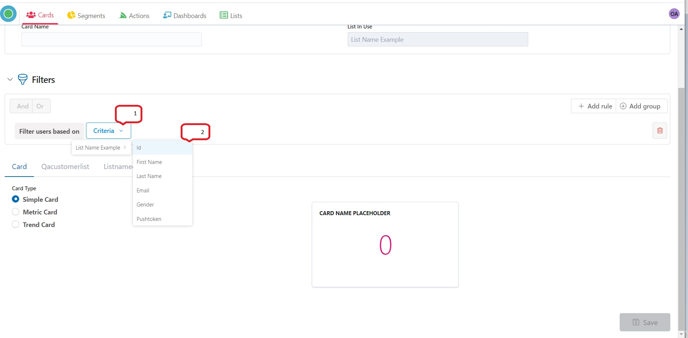
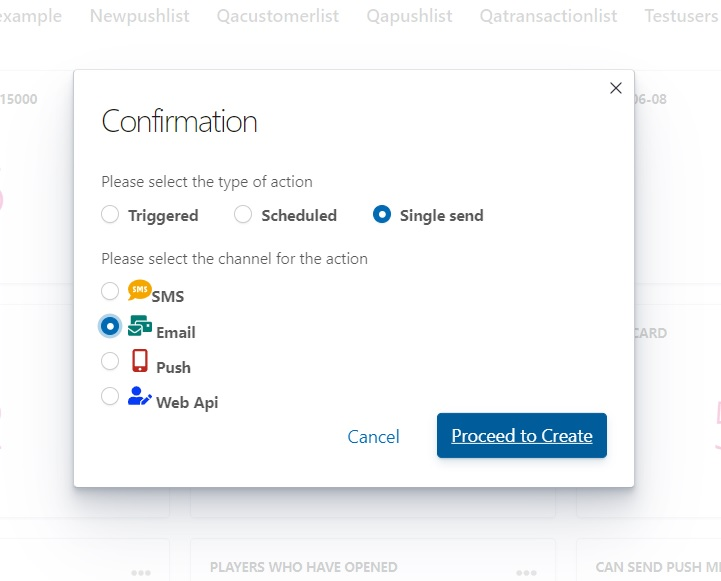

# Optikpi User Guide : Cards

* [Create](optikpi-user-guide-cards.md#cards-create)
* [Download](optikpi-user-guide-cards.md#cards-download)
* [Add action](optikpi-user-guide-cards.md#cards-addaction)
* [Edit](optikpi-user-guide-cards.md#cards-edit)
* [Clone](optikpi-user-guide-cards.md#cards-clone)
* [Delete](optikpi-user-guide-cards.md#cards-delete)

<mark style="color:red;">**This module is set for deprecation.**</mark>&#x20;

<mark style="color:red;">**Use the**</mark> [<mark style="color:red;">**Segment**</mark>](optikpi-user-guide-segments.md) <mark style="color:red;">**module for the users segmentation based on different criterias.**</mark>

Cards represent unique players of a given List based on criteria. Cards are bounded to particular Lists.

## Create 

There are 2 ways how you can create a new Card.

1. Being in a specific List of which basis you want to create a Card.
2. Being in the main Card panel.

The procedure of creation Cards in both cases is the same.

1\. Start creating a Card by pressing the "Create New Card" button from the "Cards" home screen.

&#x20;2\. Pick a list to create a Card and press the “Proceed to Create” button

3\. Provide a meaningfull name for the Card.

4\. Add criteria for your Card at the “Filters” section

5\. You can add any number of criteria into the same Card by clicking the “Add rule” button.

6\. The Card panel below displays the unique player count based on the criteria.

7\. Choosing by card type you can change preview your card look appear

8\. Save the newly created Card with the “Save” button - “Save Changes”

9\. You can see the new Card from the "Cards" home screen.

## Download 

Optikpi gives the opportunity to download data in CSV format from your Card.

1\. By Clicking on 3 dots on the Card panel, a popup with comes up.

2\. Click **Table View** to see which data and from which List contains your Card.

3\. Set your own Column Setting by choosing Available Fields.

4\. You can download data in CSV format.

5\. You can sort data in ascending or descending order.

## Add action 

You can start your Campaign directly from the Card.

By Clicking on 3 dots on the Card panel, a popup with comes up.

I. **Add Action** links you to the Confirmation panel where you can select the type of action and the channel for the action.

2\. Select the type of Action: Triggered, Scheduled (Recurring), or Single Send Action.

3\. Select the channel for the Action: SMS, Email, Push Notification, or Web API.

4\. Provide Action’s name and set Action’s definitions according to the Action’s type and type of the channel. See Paragraph ACTIONS

## Edit 

I. By Clicking on 3 dots on the Card panel, a popup with comes up.

2\. Click the “Edit” button.

3\. **Edit** allows changing Card Information, criteria of the Card and Card Type.

4\. Press the “Update” button for saving.

5\. Press the “Save Changes” button if you want to save changes or just close the dialog window if you want to exit without saving.

## Clone 

I. By Clicking on 3 dots on the Card panel, a popup with comes up.

2\. Click the “Clone” button.

3\. **Clone** is creating an identical Card adding the “Clone” word in the name.

4\. You can change Card Name, Filter settings, Rules, Card Type, or you can just save a Clone.

## Delete 

I. By Clicking on 3 dots on the Card panel, a popup with comes up.

2\. Click the “Delete” button.

4\. **Delete** allows delete card.

&#x20;When you confirm and press the “Delete” button the Card will be deleted permanently, without the possibility of recovery.
