# Optikpi User Guide : Configuration

* [Email Configurations](optikpi-user-guide-configuration.md#Configuration-EmailConfigurations)
* [SMS Configuration](optikpi-user-guide-configuration.md#Configuration-SMSConfiguration)
* [Push Configuration](optikpi-user-guide-configuration.md#Configuration-PushConfiguration)
* [Web API](optikpi-user-guide-configuration.md#Configuration-WebAPI)
* [Time Zone](optikpi-user-guide-configuration.md#Configuration-TimeZone)

## Email Configurations 

1\. Start Admin configuration by pressing the "OptiKPI Admin" button on the Up Right Side.

 (2).png>)

2\. Go ahead by pressing the "Admin Settings" icon.

 (3).png>)

3\. Choose “Email Config” on the Up Panel and then press the "Create Email Config" button.

4\. Provide Email configuration name.

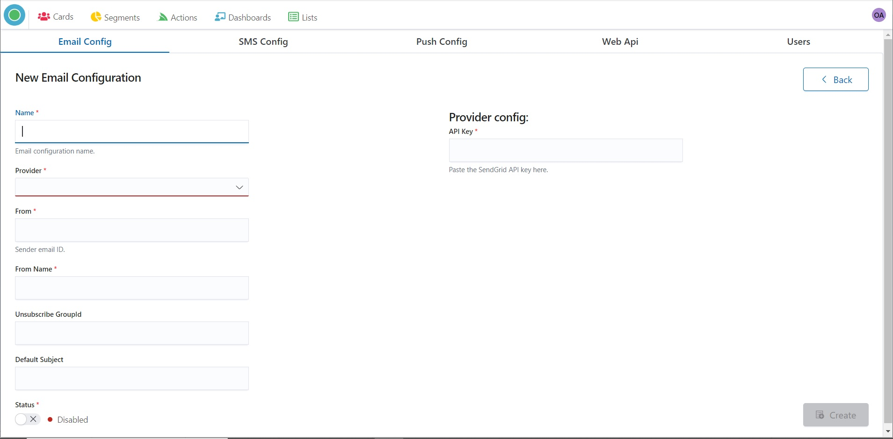

5\. Choose a Provider for your email marketing campaigns.

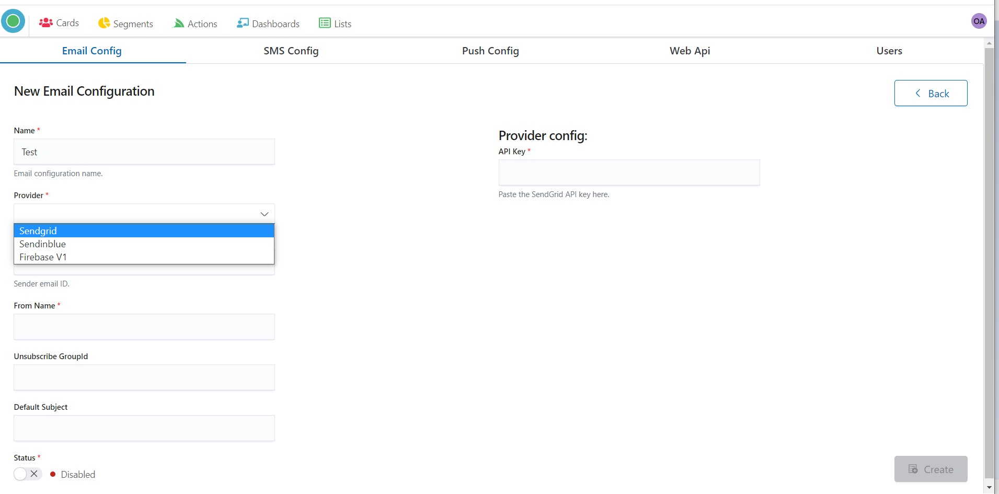

6\. Specify **Sender** email ID in the “From” field

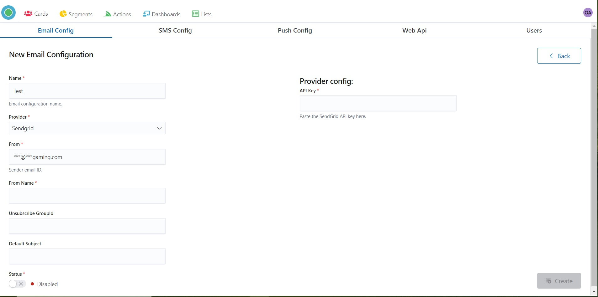

7\. Point your company name in the “From Name” field.

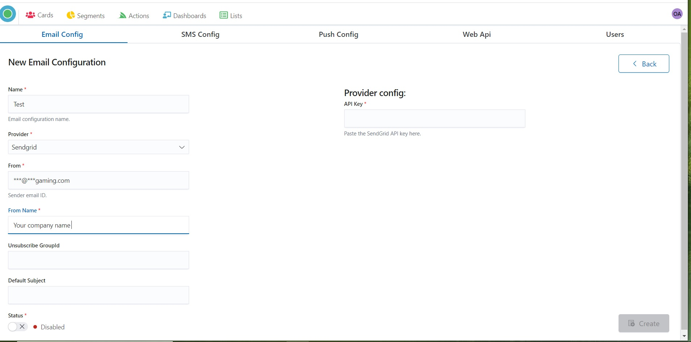

8\. Set the Status “Enabled”.

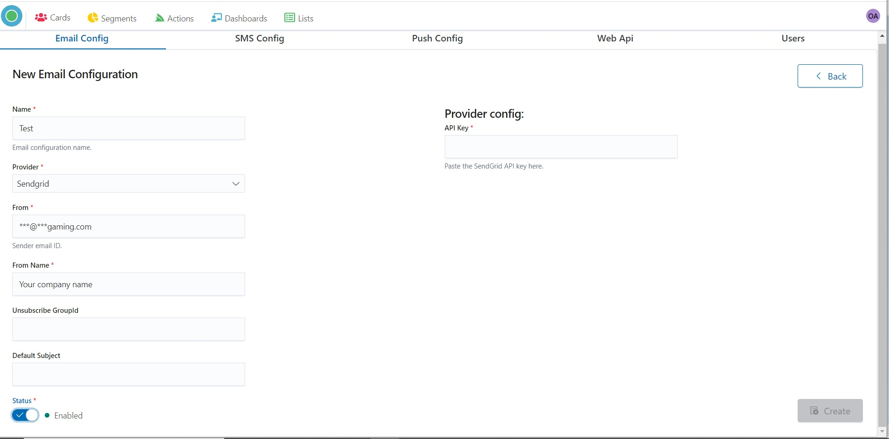

9\. Provide **API Key** by pasting the Provider’s API key in the “Provider config” field.

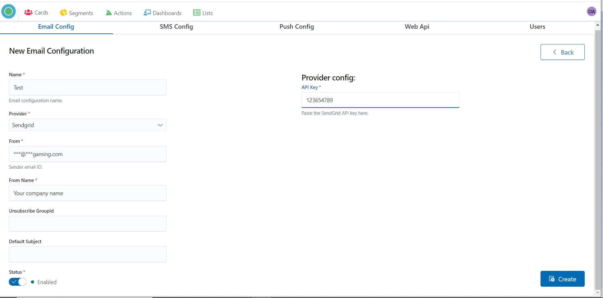

10\. Press the “Create” button for saving.

## SMS Configuration 

l. Start Admin configuration by pressing the "OptiKPI Admin" button on the Up Right Side.

 (4).png>)

2\. Go ahead by pressing the "Admin Settings" icon.

.png>)

3\. Choose “SMS Config” on the Up Panel and then press the "Create SMS Config" button.

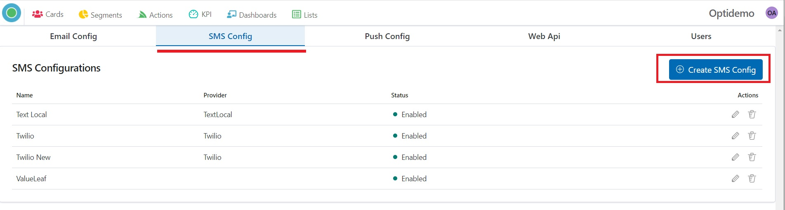

4\. Provide SMS configuration name

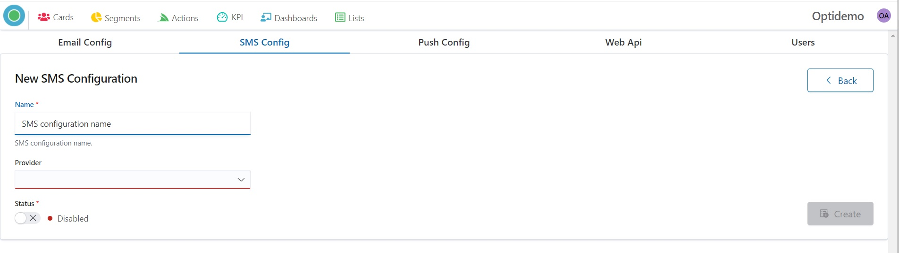

5\. Choose a Provider for your SMS marketing campaigns.

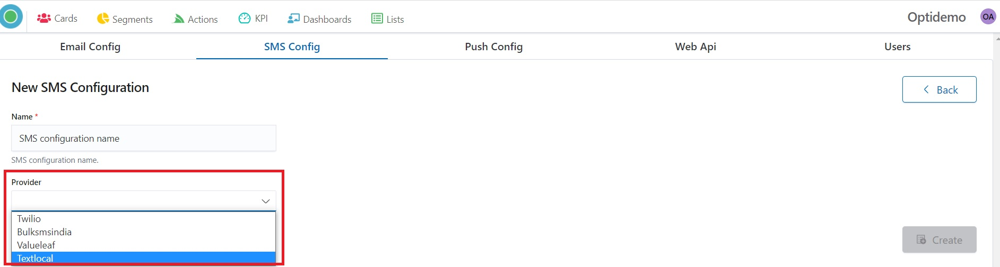

6\. Set the Status “Enabled”.

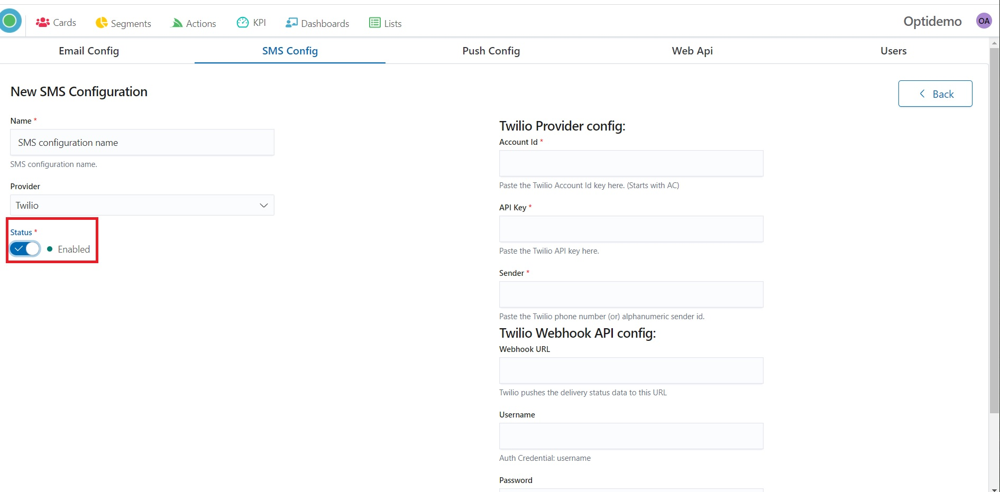

7\. Fill the form your’s Provider configuration (by pasting data from your Provider account).

**Account Id**

**API Key**

**Sender**

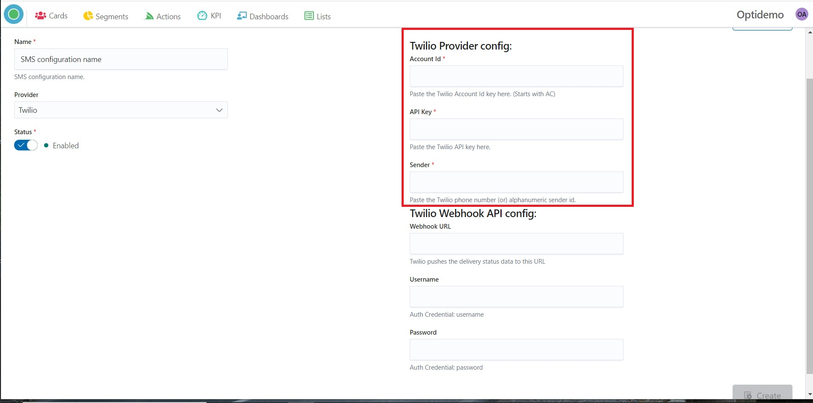

8\. Press the “Create” button for saving.

.jpg>)

## Push Configuration 

l. Start Admin configuration by pressing the "OptiKPI Admin" button on the Up Right Side.

.png>)

2\. Go ahead by pressing the "Admin Settings" icon.

 (1).png>)

3\. Choose “Push Config” on the Up Panel and then press the "Create Push Config" button.

4\. Provide Push configuration name.

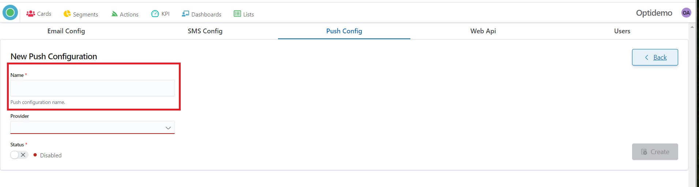

5\. Choose a Provider for your Push campaigns.

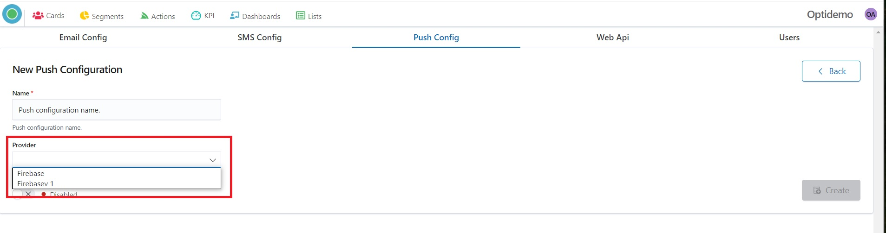

6\. Set the Status “Enabled”.

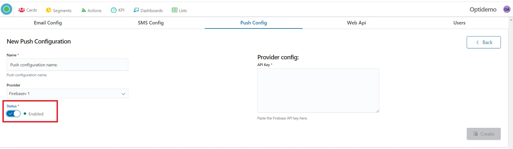

7\. Fill the form your’s Provider configuration - paste your Provider API key.

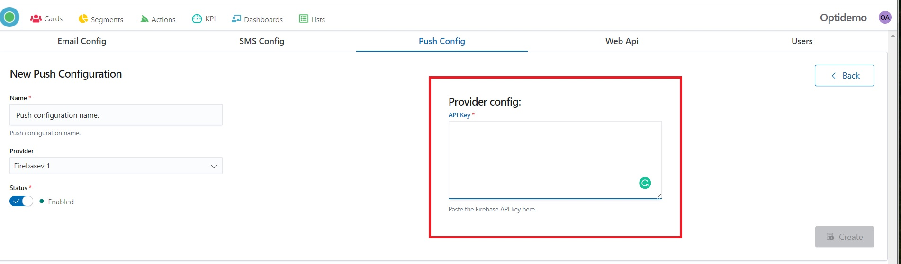

8\. Press the “Create” button for saving.

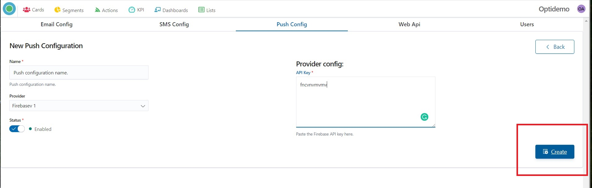

## Web API 

l. Start Admin configuration by pressing the "OptiKPI Admin" button on the Up Right Side.

 (3).png>)

2\. Go ahead by pressing the "Admin Settings" icon.

 (2).png>)

3\. Choose “Web Api” on the Up Panel and then press the "Create Custom Config" button.

.png>)

4\. Provide Api configuration name.

.png>)

5\. Choose Provider.

.png>)

6\. Set the Status “Enabled”.

.png>)

7\. Fill in the "API Endpoint" field.

.png>)

8\. Choose Authentication Type if necessary and press the "Next" button.

.png>)

9\. Set API Definition and press the "Add" button.

.png>)

10\. Press the “Create” button for saving.

.png>)

11\. You can see the newly created configuration on the Web Api List Configurations.

.png>)

## Time Zone 

l. Start Admin configuration by pressing the "OptiKPI Admin" button on the Up Right Side.

.jpg>)

2\. Choose your Time Zone.

.jpg>)

