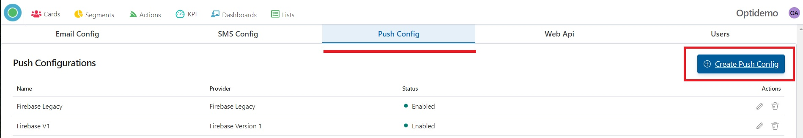

# Optikpi User Guide : Configuration

* [Email Configurations](optikpi-user-guide-configuration.md#Configuration-EmailConfigurations)
* [SMS Configuration](optikpi-user-guide-configuration.md#Configuration-SMSConfiguration)
* [Push Configuration](optikpi-user-guide-configuration.md#Configuration-PushConfiguration)
* [Web API](optikpi-user-guide-configuration.md#Configuration-WebAPI)
* [Time Zone](optikpi-user-guide-configuration.md#Configuration-TimeZone)

## Email Configurations 

1. Start Admin configuration by pressing the "OptiKPI Admin" button in the Up Right Side.

2. Go ahead by pressing the "Admin Settings" icon.

3. Choose “Email Config” in the Up Panel and then press the "Create Email Config" button.

4. Provide Email configuration name.

5. Choose a Provider for your email marketing campaigns.

6. Specify **Sender** email ID in the “From” field

7. Point your company name in the “From Name” field.

8. Set the Status “Enabled”.

9. Provide **API Key** by pasting the Provider’s API key in the “Provider config” field.

10. Press the “Create” button for saving.

## SMS Configuration 

l. Start Admin configuration by pressing the "OptiKPI Admin" button in the Up Right Side.

2. Go ahead by pressing the "Admin Settings" icon.

3. Choose “SMS Config” in the Up Panel and then press the "Create SMS Config" button.

4. Provide SMS configuration name

5. Choose a Provider for your SMS marketing campaigns.

6. Set the Status “Enabled”.

7. Fill the form your’s Provider configuration \(by pasting data from your Provider account\).

**Account Id**

**API Key**

**Sender**

8. Press the “Create” button for saving.

## Push Configuration 

l. Start Admin configuration by pressing the "OptiKPI Admin" button on the Up Right Side.

2. Go ahead by pressing the "Admin Settings" icon.

3. Choose “Push Config” in the Up Panel and then press the "Create Push Config" button.

4. Provide Push configuration name.

5. Choose a Provider for your Push campaigns.

6. Set the Status “Enabled”.

7. Fill the form your’s Provider configuration - paste your Provider API key.

8. Press the “Create” button for saving.

## Web API 

l. Start Admin configuration by pressing the "OptiKPI Admin" button in the Up Right Side.

2. Go ahead by pressing the "Admin Settings" icon.

3. Choose “Web Api” in the Up Panel and then press the "Create Custom Config" button.

4. Provide Api configuration name.

5. Choose Provider.

6. Set the Status “Enabled”.

7. Fill in the "API Endpoint" field.

8. Choose Authentication Type if necessary and press the "Next" button.

9. Set API Definition and press the "Add" button.

10. Press the “Create” button for saving.

11. You can see the newly created configuration in the Web Api List Configurations.

## Time Zone 

l. Start Admin configuration by pressing the "OptiKPI Admin" button in the Up Right Side.

2. Choose your Time Zone.

