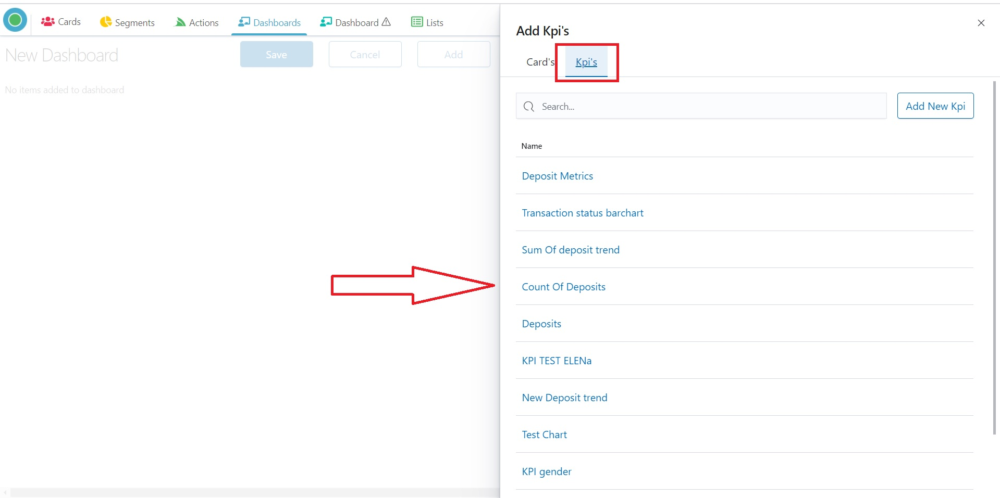
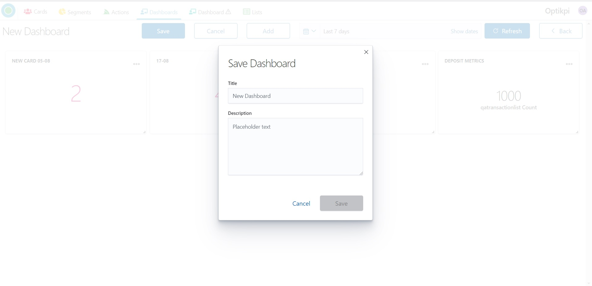
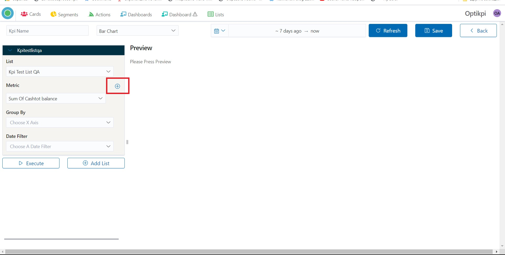
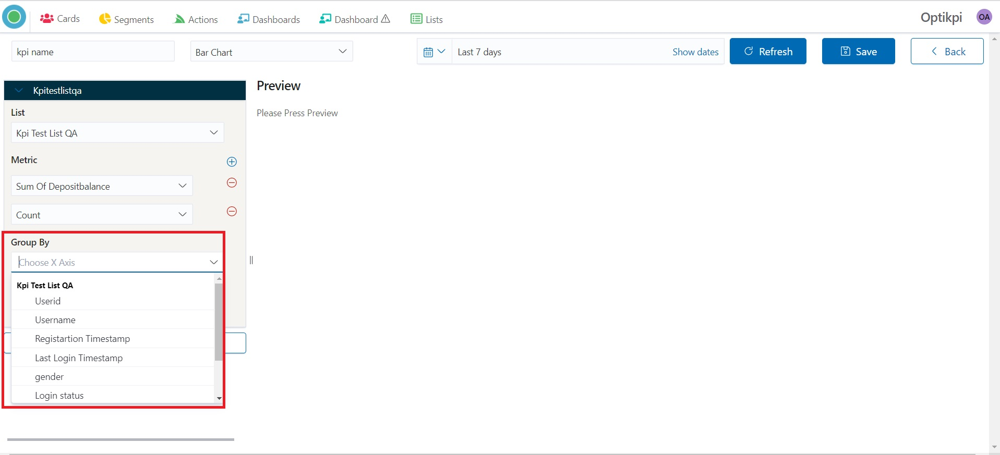

# Optikpi User Guide : Dashboards

* [Create](optikpi-user-guide-dashboards.md#Dashboards-Create)
* [Create KPI](optikpi-user-guide-dashboards.md#Dashboards-CreateKPI)
* [Edit Dashboard](optikpi-user-guide-dashboards.md#Dashboards-EditDashboard)
* [Edit KPI](optikpi-user-guide-dashboards.md#Dashboards-EditKPI)
* [Delete KPI](optikpi-user-guide-dashboards.md#Dashboards-DeleteKPI)
* [Delete Dashboard](optikpi-user-guide-dashboards.md#Dashboards-DeleteDashboard)

## Create 

I. Start creating a Dashboard by pressing the "Create New Dashboard" button From the "Dashboards" home screen.

2. Press the “Add” button.

3. Pick the existing card or KPI by clicking on the link

 4. After one click on the link the Card will be added to the Dashboard.

5. Close the window after finishing.

6. To save your Dashboard press the "Save" button

7. Provide name and description.

8. Press “Save” to finish.

## Create KPI 

Your Dashboard may consist of Cards and KPIs panels. Here you will know how to create and add KPI to the Dashboard.

 I. Start creating a Dashboard by pressing the "Create New Dashboard" button From the "Dashboards" home screen.

2. Press the “Add” button.

3. Choose the KPI’s field and press the “Add New Kpi” button.

4. Provide KPI Name.

5. Choose the model of data representation: Bar Chart, Line Chart, Funnel or Metric.

6. Set the needed time period.

7. Pick up the List. You can start typing its name and the system will find it.

8. Choose Y-Axis in the Metric field.

9. By clicking on the “+” icon you can add Metric.

9. Choose Y-Axis

10. Select other view options.

11. Define the order of data presentation.

12. Set how many columns you will see.

13. Use Filter for presentation.

14. Press the “Execute” button.

 15. You will see your KPI created.

16. Press the “Save” button to finish.

### Bar Chart 

Use a bar chart to show comparisons among discrete categories. One axis of the chart shows the specific categories being compared, and the other axis represents a measured value.

### Line Chart 

Use a line chart to visualize a trend in data over intervals of time – a time series.

### Funnel 

Use Funnel charts to visualize the progressive reduction of data as it passes from one phase to another. Funnel charts can be used to represent Cards, Segments and Actions data.

I. Start creating your Funnel by choosing this type of data presenting in the top menu box.

2. Choose Cards/Segments or Actions by scrolling down. 

3. Press the “Execute” button and Provide label for the Funnel.

4. Press the colored circle to change the color of this funnel.

5. Press the “Execute” button.

6. Add one more Funnel using the “plus” icon.

7. Choose Cards/Segments or Actions, and color.

8. Press the “execute” button.

9. Use Switching on/off to hide Metric Conversion.

10. Save your KPI.

### Metric 

Use Metric to present specific data.  

## Edit Dashboard 

I. Start editing a Dashboard by pressing the "Edit" button From the "Dashboards" home screen or by pressing the name of the Dashboard in the list.

2. You can change the order of the presenting by dragging the plate. As well as you can change the size of the frame. 

3. By clicking on 3 dots on the KPI plate, a popup with comes up.

4. You can Remove KPI from the current Dashboards. This KPI will still be available in the Default Dashboard \(where are all KPIs gathered\).

5. You can Delete KPI - in this case, KPI will be deleted irretrievably.

## Edit KPI 

I. Start editing a KPI by pressing the "Edit" button From the "Dashboards" home screen or by pressing the name of the Dashboard in the list.

2. By clicking on 3 dots on the KPI plate, a popup with comes up.

3. Choose “Edit”.

4. KPI editing form will appear.

5.  Press the “Update” button to finish.

## Delete KPI 

By clicking on 3 dots on the KPI plate, a popup with comes up.

You can Delete KPI - in this case, KPI will be deleted irretrievably.

## Delete Dashboard 

 I. Choose the Dashboard which you need to delete and check the box. Press the button “Delete”.

2. Confirm

