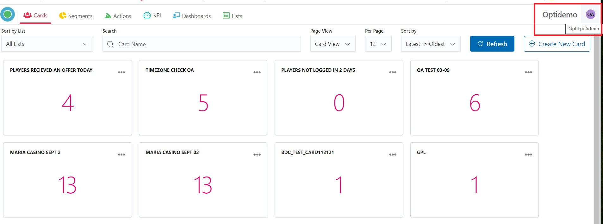
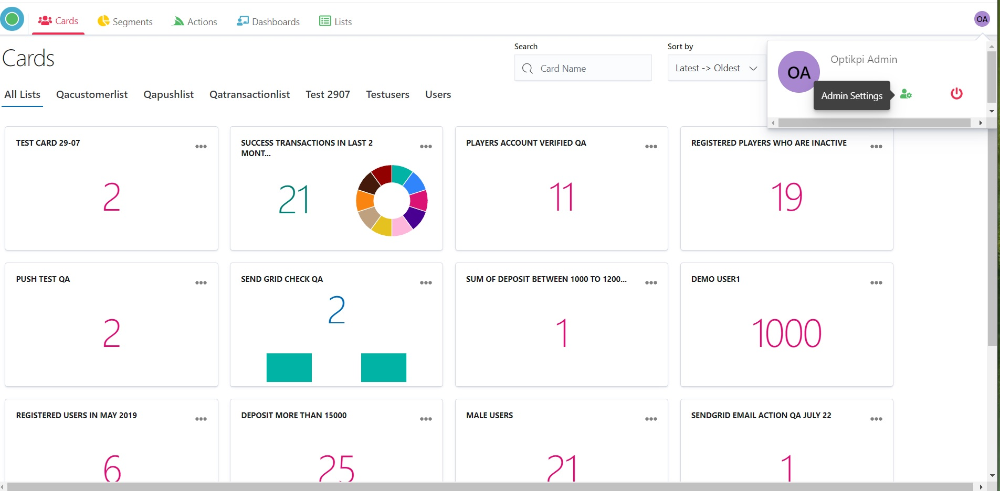
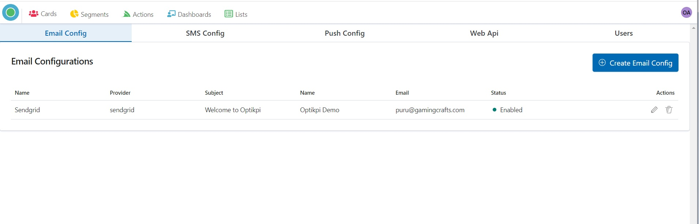
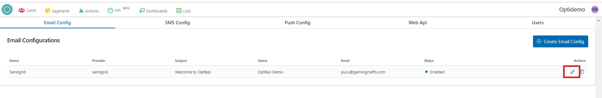
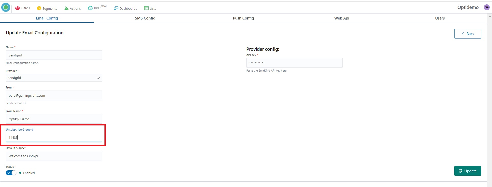
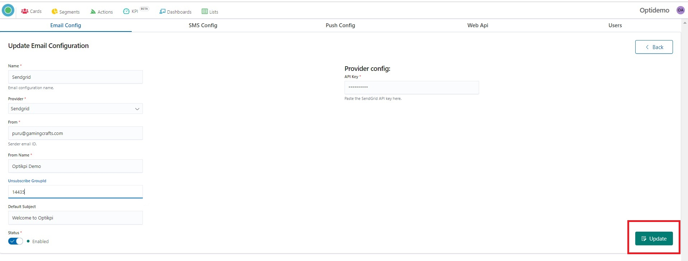

# Optikpi User Guide : Handling Unsubscribe

* [Configure unsubscribe group](optikpi-user-guide-handling-unsubscribe.md#HandlingUnsubscribe-Configureunsubscribegroup)
* [Unsubscribe link](optikpi-user-guide-handling-unsubscribe.md#HandlingUnsubscribe-Unsubscribelink)

There are two ways to get Unsubscribe done from Optikpi itself:

1. Configure the unsubscribe group ID from Settings in Optikpi for SendGrid.
2. Add an unsubscribe link in the Templates.

## Configure unsubscribe group <a id="HandlingUnsubscribe-Configureunsubscribegroup"></a>

For getting an unsubscribe group ID, you have to go to the SendGrid account and create an unsubscribe group once and can configure it in Optikpi.

I. Start Admin configuration by pressing the "OptiKPI Admin" button on the Up Right Side.



2. Go ahead by pressing the "Admin Settings" icon.



3. Choose “Email Config” in the Up Panel.



4. Find the line with the needed Provider and click on the pencil icon.



5. In the “Unsubscribe group id” field fill the SendGrid ID Group.



6. Press the “Update” button.



SendGrid automatically adds an unsubscribe link at the bottom of your email.

* [Configure unsubscribe group](optikpi-user-guide-handling-unsubscribe.md#HandlingUnsubscribe-Configureunsubscribegroup)
* [Unsubscribe link](optikpi-user-guide-handling-unsubscribe.md#HandlingUnsubscribe-Unsubscribelink)

## Unsubscribe link <a id="HandlingUnsubscribe-Unsubscribelink"></a>

I. From the templates, you can add an unsubscribe link by adding the tag to the anchor tag:

**Button - URL -**

```text
<%asm_group_unsubscribe_raw_url%>
```

**Link**

```text
<div style="text-align:center"><a href="<%asm_group_unsubscribe_raw_url%>" >Unsubscribe</a></div
```

