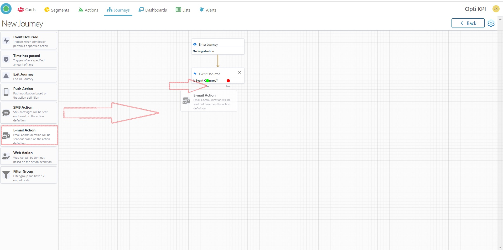

# Optikpi User Guide : Journeys

[Getting start with Journey](https://app.gitbook.com/@puru/s/optikpi-user-guide/\~/drafts/-MYubqWgT-SbgBLgFFF9/optikpi-user-guide-journeys#getting-start-with-journey)

[Create NewJourney](https://app.gitbook.com/@puru/s/optikpi-user-guide/\~/drafts/-MYubqWgT-SbgBLgFFF9/optikpi-user-guide-journeys#create-newjourney)

[Edit Journey](https://app.gitbook.com/@puru/s/optikpi-user-guide/\~/drafts/-MYubqWgT-SbgBLgFFF9/optikpi-user-guide-journeys#edit-journey)

[Clone Journey](https://app.gitbook.com/@puru/s/optikpi-user-guide/\~/drafts/-MYubqWgT-SbgBLgFFF9/optikpi-user-guide-journeys#clone-journey)

[Delete Journey](https://app.gitbook.com/@puru/s/optikpi-user-guide/\~/drafts/-MYubqWgT-SbgBLgFFF9/optikpi-user-guide-journeys#delete-journey)

## Getting start with Journey

**Use this feature for creating entire customer Journey across channels and events.**

You can build a Journey using the Journey tools and the Actions that are available in the Sketchpad. The Sketchpad contains two types of blocks - Journey Actions and Journey tools.

Working with Journey, consider the following categories:

* **Journey features** - description of Journey functions.
* **Journey Actions** - allow to integrate with delivery channels.
* **Journey tools** - help you to design Journey execution logic.

**Journey features** - description of Journey functions.&#x20;

| _**Feature**_  | _**Description**_                              |
| -------------- | ---------------------------------------------- |
| Clone          | Clone is creating an identical Journey         |
| **Re-arrange** | Re-arrange return to default position          |
| **Clear**      | Clear and return to the first stage            |
| **Activate**   | Make Journey active                            |
| **Deactivate** | Make Journey inactive, stop actions' launching |

**Journey Actions** - allow to integrate with delivery channels.

| _**Actions**_ | _**Description**_                                                           |
| ------------- | --------------------------------------------------------------------------- |
| **Push**      | Is the action with a message that pops up on the user's device              |
| **SMS**       | Is the action through outgoing SMS text messages to different recipients    |
| **Email**     | The action is an email notification, can be plain text or styled using HTML |
| **Web**       | Action will be sent out based on the action definition.                     |

**Journey tools** - help you to design Journey execution logic.

| _**Tools**_         | _**Description**_                                                                                                   |
| ------------------- | ------------------------------------------------------------------------------------------------------------------- |
| **Enter Journey**   | Block allows you to set Users' flow based on configured conditions                                                  |
| **Event Occurred**  | Block allows you to split the Users flow based on any events that happened or the audience response to any actions. |
| **Time has passed** | Block allows to set period of time that must pass                                                                   |
| **Filter Group**    | Block allows to split the Journey user flow based on configured conditions.                                         |
| **Exit Journey**    | Block allows to measure the percentage of actions execution                                                         |

## Create New Journey

**This tutorial video will help you to Create a Journey**&#x20;

[https://www.youtube.com/watch?v=cSnNskL0cTk](https://www.youtube.com/watch?v=cSnNskL0cTk)

I. Start creating a Journey by pressing the "Create New Journey" button from the "Journeys" home screen.

.png>)

2\. Drag blocks from the left-side panel. To move an item: hover the mouse pointer over the block press and hold the mouse button, as you drag and drop the item into its new location on the sketchpad.

3\. Using drag and drop function you can connect blocks via input/out points.

4\. You can remove block from a Journey by pressing a remove icon.

#### Save

I. At the top left of the sketchbook, find a tool icon.&#x20;

.jpg>)

2\. Click this icon, it will allow you to choose the "Save" command.

3\. Change the auto-generated name and click the "Update" button.

 (2).png>)

4\. Now your Journey is saved. You can continue creating or activate it.

#### Clone

<mark style="color:red;">**Feature currently not available**</mark>

I. At the top left of the sketchbook, you’ll notice a tool icon.&#x20;

.jpg>)

2\. Click this icon, it will allow you to choose the "Clone" command.

3\. Now you have a clone of your Journey. You can change it and save it before activation.

#### Re-arrange

I. At the top left of the sketchbook, find a tool icon.&#x20;

.png>)

2\. Click this icon, it will allow you to choose the "Re-arrange" command.

3\. Press "Re-arrange" to re-arrange the Journey.

#### Clear

I. At the top left of the sketchbook, find a tool icon.&#x20;

 (1).png>)

2\. Click this icon, it will allow you to choose the "Clear" command.

3\. Confirm that you want to remove all the blocks from the Journey by pressing the "Clear" button.

 (1).png>)

4\. Now you can start from the first step.

 (1).png>)

#### Activate

I. At the top left of the sketchbook, find a tool icon.&#x20;

 (1).png>)

2\. Click this icon, it will allow you to choose the "Activate" command.

3\. Set Start and End Date for your Journey.

 (1).png>)

4\. Press the "Activate button" and the Journey will start in several minutes.

.png>)

#### Deactivate

I. After activation, it's possible to deactivate the Journey. At the top left of the activated journey, find a tool icon.

2\. Click this icon, it will allow you to choose the "Deactivate" command.

The deactivation feature breaks of the Journey.

### Enter Journey

"Enter Journey" Block allows you to set Users' flow based on configured conditions.

I. Provide the name.

2\. In the Query set criteria

2a. for chosen List, Card, Segment, or Action.

2b. Press the "Execute button".

3\. You will get the card of the Enter Journey.

###

###

### Event Occurred

"Event occurred" Block allows you to split the Users flow based on any events that happened or the audience response to any actions.

I. Provide the name.

2\. Set criteria.

3\. Press the "Close" button.

### Time has passed

"Time has passed" Block allows to set period of time that must pass.

I. Provide the Name.

2\. Set Time and Time Format.

3\. Press the "Close" button.

### Filter Group

"Filter Group" block allows to split the Journey user flow based on configured conditions.

I. Provide the Name.

2\.  Set the number of branches by moving the range slider.

3\. Click the link to set query for the branch.

4\. Name the branch

5\. Set criteria.

6\. After setting criteria for each branch press the "Close" button.

### Exit Journey

"Exit Journey" block allows to measure the percentage of actions execution.

Every Journey should have at least 1 exit Journey goal.

### Push Action

Is the action with a message that pops up on the user's device.

I. Double click on the "Push Action" block opens it.

2\. Now you can start filling the "Push Action" form.

3\. Provide Name, Config, Title, Message, Image.&#x20;

.png>)

4\. In the menu tab "Branches" set the number of branches that you need.

.png>)

5\. Now you can close the block.

.png>)

###

### SMS Action

Is the action through outgoing SMS text messages to different recipients

I. Double click on the "SMS Action" block opens it.

.png>)

2\. Now you can start filling the "SMS Action" form.

3\. Provide Name, Config, Message.

.png>)

4\. In the menu tab "Branches" set the number of branches that you need.

5\. Now you can close the block.

.png>)

### Email Action

The action is an email notification, can be plain text or styled using HTML.

I. Double click on the "E-mail Action" block opens it.

.png>)

2\. Now you can start filling the "E-mail Action" form.

.png>)

3\. Provide Name, Config, Subject,  Preheader.

.png>)

4\. Choose Templates.&#x20;

.png>)

5\. In the menu tab "Branches" set the number of branches that you need.

.png>)

6\. Now you can close the block.

.png>)

### Web Action

Action will be sent out based on the action definition.

I. Double click on the "Web Action" block opens it.

.png>)

2\. Now you can start filling the "Web Action" form.

.png>)

3\. Provide Name, Select Config.

.png>)

4\. In the menu tab "Branches" set the number of branches that you need.

5\. Now you can close the block.

.png>)

###

## Edit Journey

The feature inactives Journey during edit, allows you to put some changes, add / delete blocks of actions, then Journey needs to be activated again manually.&#x20;

During the editing Journey only the Enter Journey block is not editable. The rest of all are editable. As well as you can add a new Action’s block to the Journey (SMS, email, Push or Web API).

I. Start from the main "Journeys" home screen.

.png>)

2\. Enter into the Journey by clicking on the Name or the View icon.&#x20;

.png>)

3\. Find the Service tools icon at the right part of the Navigation bar and click the “Edit” button.

4\. Confirm Edit.

.png>)

5\. The feature inactives Journey during edit, allows you to put some changes, add / delete blocks of actions, then Journey needs to be activated again manually.&#x20;

During the editing Journey only the Enter Journey block is not editable. The rest of all are editable. As well as you can change, add or delete Action’s block to the Journey (SMS, email, Push or Web API).

.png>)

6\. To finish find the Service tools icon at the right part of the Navigation bar and press the “Save” button.&#x20;

7\. Press the “Activate” button.&#x20;

8\. Confirm Start and End Date.

.png>)

Your journey activated successfully.

## Clone Journey

<mark style="color:red;">**Feature currently not available**</mark>

I. Start from the main "Journeys" home screen.

 (2).png>)

2\. Press the "Clone" icon.

3\. You can change name of the Journey, add or delete blocks as well as settings for blocks.

## Delete Journey

I. Start from the main "Journeys" home screen.

 (1).png>)

2\. Choose the Journey.

3\. Press the "Delete" button.

4\. Confirm your action.

