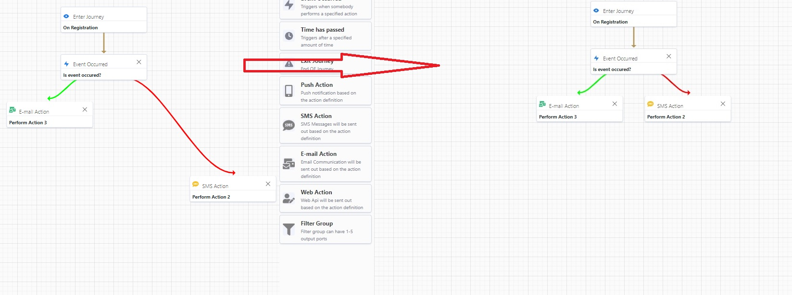
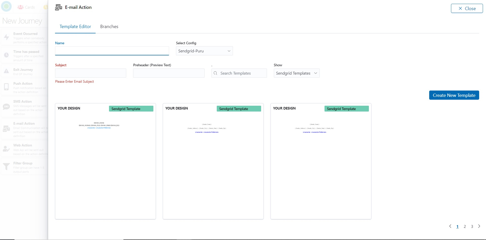
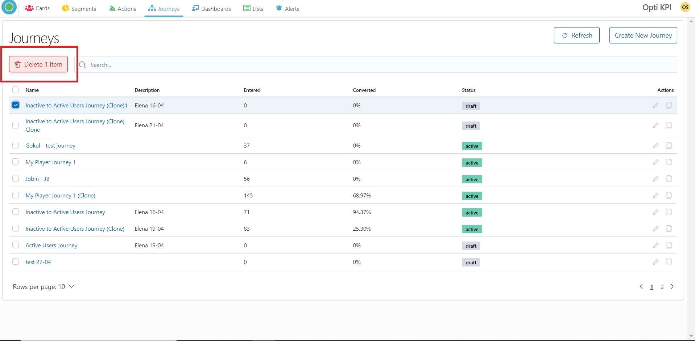

# Optikpi User Guide : Journeys

[Getting start with Journey](https://app.gitbook.com/@puru/s/optikpi-user-guide/~/drafts/-MYubqWgT-SbgBLgFFF9/optikpi-user-guide-journeys#getting-start-with-journey)

[Create NewJourney](https://app.gitbook.com/@puru/s/optikpi-user-guide/~/drafts/-MYubqWgT-SbgBLgFFF9/optikpi-user-guide-journeys#create-newjourney)

[Edit Journey](https://app.gitbook.com/@puru/s/optikpi-user-guide/~/drafts/-MYubqWgT-SbgBLgFFF9/optikpi-user-guide-journeys#edit-journey)

[Clone Journey](https://app.gitbook.com/@puru/s/optikpi-user-guide/~/drafts/-MYubqWgT-SbgBLgFFF9/optikpi-user-guide-journeys#clone-journey)

[Delete Journey](https://app.gitbook.com/@puru/s/optikpi-user-guide/~/drafts/-MYubqWgT-SbgBLgFFF9/optikpi-user-guide-journeys#delete-journey)

## Getting start with Journey

Use this feature for creating entire customer Journey across channels and events.

You can build a Journey using the Journey tools and the Actions that are available in the Sketchpad. The Sketchpad contains two types of blocks - Journey Actions and Journey tools.

Working with Journey, consider the following categories:

* **Journey features** - description of Journey functions.
* **Journey Actions** - allow to integrate with delivery channels.
* **Journey tools** - help you to design Journey execution logic.

Journey features - description of Journey functions. 

| Feature | Description |
| :--- | :--- |
| Clone | Clone is creating an identical Journey |
| Re-arrange | Re-arrange return to default position |
| Clear | Clear and return to the first stage |
| Activate | Make Journey active |
| Deactivate | Make Journey inactive, stop actions' launching |

Journey Actions - allow to integrate with delivery channels.

| Actions | Descriopion |
| :--- | :--- |
| Push | Is the action with a message that pops up on the user's device |
| SMS | Is the action through outgoing SMS text messages to different recipients |
| Email | The action is an email notification, can be plain text or styled using HTML |
| Web | Action will be sent out based on the action definition. |

Journey tools - help you to design Journey execution logic.

| Tools | Description |
| :--- | :--- |
| Enter Journey | Block allows you to set Users' flow based on configured conditions |
| Event Occurred | Block allows you to split the Users flow based on any events that happened or the audience response to any actions. |
| Time has passed | Block allows to set period of time that must pass |
| Filter Group | Block allows to split the Journey user flow based on configured conditions. |
| Exit Journey | Block allows to measure the percentage of actions execution |

## Create NewJourney

I. Start creating a Journey by pressing the "Create New Journey" button from the "Journeys" home screen.

2. Drag blocks from the left-side panel. To move an item: hover the mouse pointer over the block press and hold the mouse button, as you drag and drop the item into its new location on the sketchpad.

3. Using drag and drop function you can connect blocks via input/out points.

4. You can remove block from a Journey by pressing a remove icon.

#### Save

I. At the top left of the sketchbook, you’ll notice a tool icon. 

2. Click this icon, it will allow you to choose the "Save" command.

3. Provide Title and Description.

4. Press the "Save" button.

5. Now your Journey is saved. You can continue creating or activate it.

#### Clone

I. At the top left of the sketchbook, you’ll notice a tool icon. 

2. Click this icon, it will allow you to choose the "Clone" command.

3. Now you have a clone of your Journey. You can change it and save it before activation.

#### Re-arrange

I. At the top left of the sketchbook, you’ll notice a tool icon. 

2. Click this icon, it will allow you to choose the "Re-arrange" command.

3. Press "Re-arrange" to re-arrange the Journey.

#### Clear

I. At the top left of the sketchbook, you’ll notice a tool icon. 

2. Click this icon, it will allow you to choose the "Clear" command.

3. Confirm that you want to remove all the blocks from the Journey by pressing the "Clear" button.

4. Your Journey will return to the first step.

#### Activate

I. At the top left of the sketchbook, you’ll notice a tool icon. 

2. Click this icon, it will allow you to choose the "Activate" command.

3. Set Start and End Date for your Journey.

4. Press the "Activate button" and the Journey will start in several minutes.

#### Deactivate

I. After activation, it's possible to deactivate the Journey. At the top left of the activated journey, you’ll notice a tool icon.

2. Click this icon, it will allow you to choose the "Deactivate" command.

3. After deactivation, you can change conditions in the blocks by clicking a unit you need.

### Enter Journey

"Enter Journey" Block allows you to set Users' flow based on configured conditions.

I. Provide the name.

2. In the Query set criteria

2a. for chosen List, Card, Segment, or Action.

2b. Press the "Execute button".

3. You will get the card of the Enter Journey.

### 

### 

### Event Occurred

"Event occurred" Block allows you to split the Users flow based on any events that happened or the audience response to any actions.

I. Provide the name.

2. Set criteria.

3. Press the "Close" button.

### Time has passed

"Time has passed" Block allows to set period of time that must pass.

I. Provide the Name.

2. Set Time and Time Format.

3. Press the "Close" button.

### Filter Group

"Filter Group" block allows to split the Journey user flow based on configured conditions.

I. Provide the Name.

2.  Set the number of branches by moving the range slider.

3. Click the link to set query for the branch.

4. Name the branch

5. Set criteria.

6. After setting criteria for each branch press the "Close" button.

### Exit Journey

"Exit Journey" block allows to measure the percentage of actions execution

#### 

### Push Action

### 

### SMS Action

### Email Action

### Web Action

## Edit Journey

I. Start from the main "Journeys" home screen.

2. Press the "Edit" icon.

3. You can change names and settings for blocks.

## Clone Journey

I. Start from the main "Journeys" home screen.

2. Press the "Clone" icon.

3. You can change name of the Journey, add or delete blocks as well as settings for blocks.

## Delete Journey

I. Start from the main "Journeys" home screen.

2. Choose the Journey.

3. Press the "Delete" button.

4. Confirm your action.

