# Optikpi User Guide : Lists

* [Retention](optikpi-user-guide-lists.md#Lists-Retention)
  * [Customer](optikpi-user-guide-lists.md#Lists-Customer)
  * [Event](optikpi-user-guide-lists.md#Lists-Event)
* [Acquisition](optikpi-user-guide-lists.md#Lists-Acquisition)
* [API](optikpi-user-guide-lists.md#Lists-API)
  * [Create](optikpi-user-guide-lists.md#Lists-Create)
  * [Update](optikpi-user-guide-lists.md#Lists-Update)
  * [Delete](optikpi-user-guide-lists.md#Lists-Delete)
* [CSV](optikpi-user-guide-lists.md#Lists-CSV)
  * [Create](optikpi-user-guide-lists.md#Lists-Create.1)
  * [Update](optikpi-user-guide-lists.md#Lists-Update.1)
  * [Delete](optikpi-user-guide-lists.md#Lists-Delete.1)
  * [Data Types](optikpi-user-guide-lists.md#Lists-DataTypes)
  * [Add to Rule ](optikpi-user-guide-lists.md#Lists-AddtoRule)

## Retention <a id="Lists-Retention"></a>

Use Retention List for keeping or containing data of existing customers. You can push data into the list using a unique User ID.

### Customer <a id="Lists-Customer"></a>

Lists are storage units to track customer profiles and events.

Customer List is a place where you can track the profiles of your customers. The Customer List holds the user profile data like Email, Phone, etc.

### Event <a id="Lists-Event"></a>

Lists are storage units to track customer profiles and events

Event List is a place where you can track customers' events. Like “Login", "Transaction", "Clicks" etc. Event List is a list that tracks relevant user events. There can be more than one event list.

## Acquisition <a id="Lists-Acquisition"></a>

Use Acquisition List for proceeding data for customers which are not yet in the System.

## API <a id="Lists-API"></a>

### Create <a id="Lists-Create"></a>

Here you will know how to create an API List.

I. Start creating a List by pressing the "New Customer List" button From the "Lists" home screen.

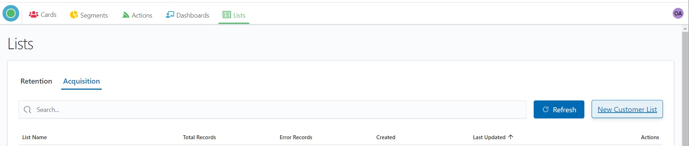

2. Provide List name, List Description and choose List source \(API List\).

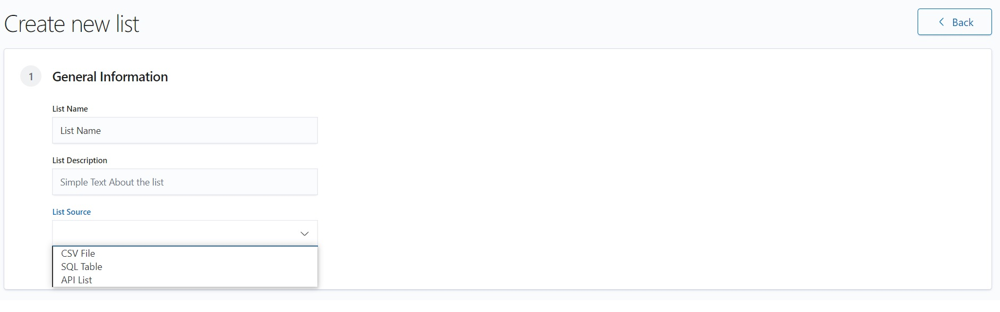

3. Choose a file that contains data.

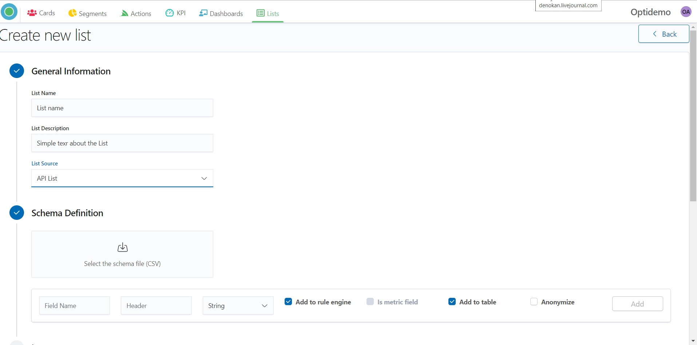

4. Set Schema Definition.

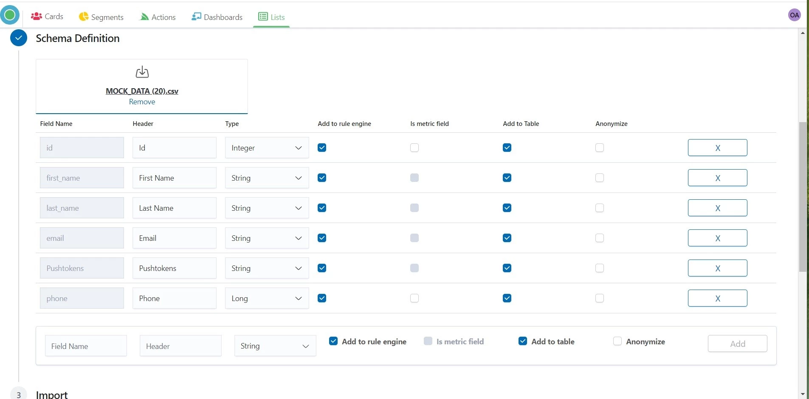

5. Clicking on the field **Add to rule engine** you can switch on/off of adding this data to your List.

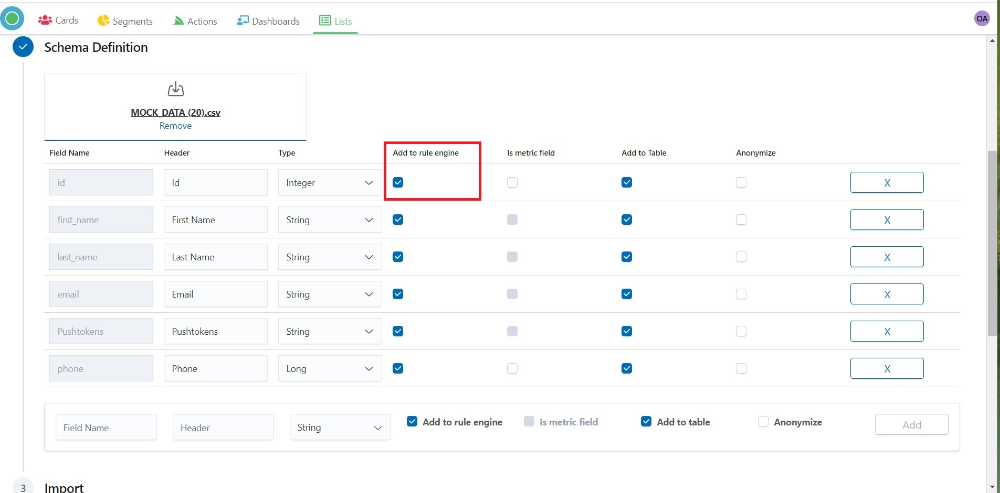

6. Switching on the field **“Is metric field”** you can point this data like a metric.

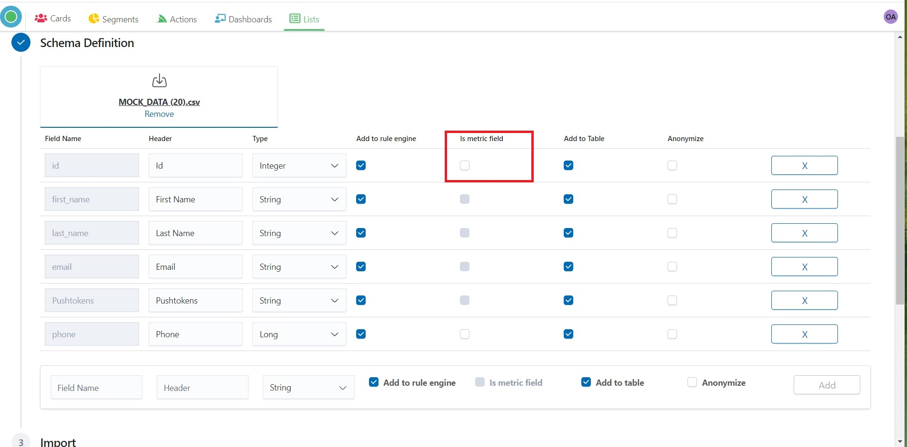

7. Switching on the field “ **Add to Table”** you can add/remove data to/from your List.

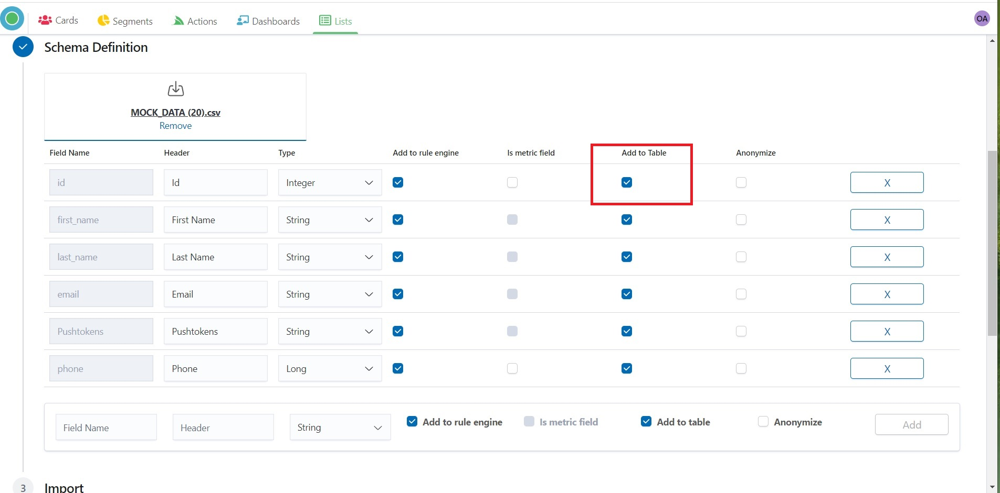

8. Switching on the field **“Anonymize”** you can change the visibility of data in the list, as well in the cards and segments.

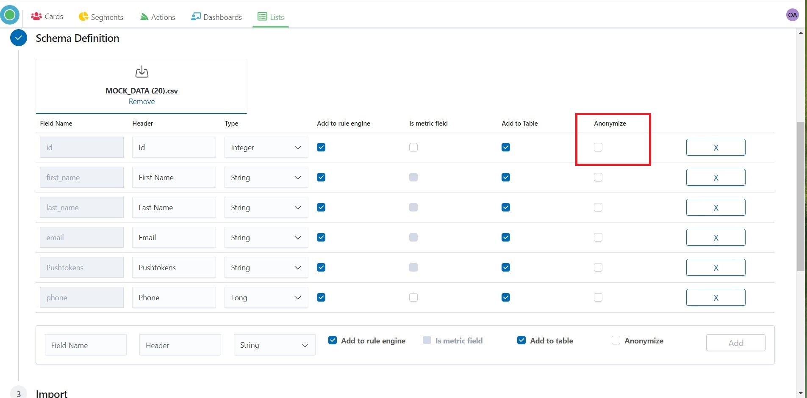

9. Clicking on the field **X** you can delete data from the list.

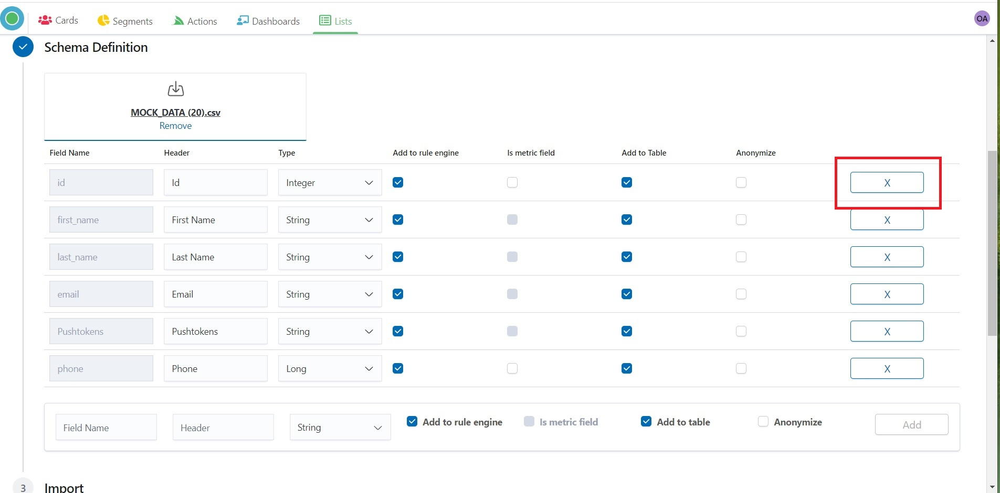

10. Map the following details from the List fields.

| **Name** | **Description** |
| :--- | :--- |
| `Unique Id` | Unique Identifier of each record in the list |
| `User/Customer Id` | Unique Identifier of each Customer. Please note, this should be the same column in all the list |
| `Email` | Field which stores the customer email, used for Email Communication |
| `Phone Contact` | Field which stores the customer phone number value, used in SMS Communication |
| `Push Tokens` | Field which stores device-specific push tokens as a string array |

11. Press the button “**Create API List”** and your list will be created.


12. At any time you can peek into your list content from the List details page.

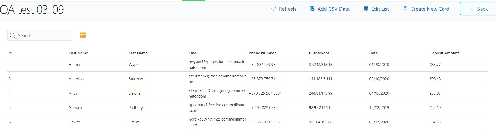

13. Start pushing data into the list using standard Http Post call.

For Example.

```text
 curl --location --request POST 'https://customer.optikpi.com/lists/User' 
    --header 'Content-Type: application/json' 
    --data-raw '{
        "PK_USER_ID":"xxxxx",
        "EMAIL":"xxx@email.com",
        "PHONE":"345666699"
    }'
```


### Update <a id="Lists-Update"></a>

I. You can change any List by clicking on the “pen” icon.


2. Or you can change any List by clicking the "Edit List" on the Up Panel inside the List.


3. While Updating List you can update List Description, set new Schema Definition, delete ou add a new column.


4. Clicking the "Update API List" you will see your List updating.


### Delete <a id="Lists-Delete"></a>

Be careful!

List can be deleted only by the administrator.  
At this moment it is impossible to identify if the list is used in another Optikpi tool: cards, segments or actions.

If you delete a list that is using in another Optikpi tool you can break Cards or Segments or stop a Campaign.

I. You can delete any List by clicking on the “Trash” icon.

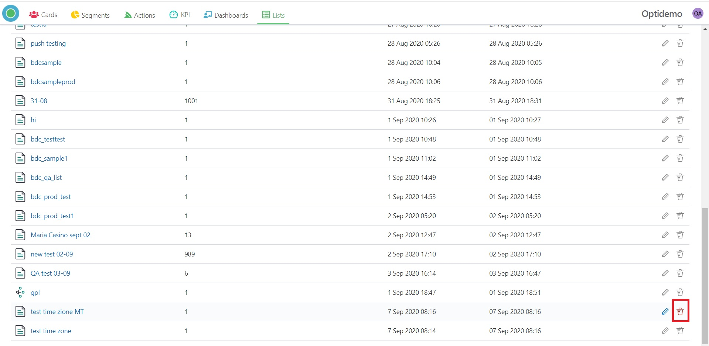

2. System will ask you “Do you really want to delete the List?”



When you confirm and press the “Delete” button the List will be deleted permanently, without the possibility of recovery.


## CSV <a id="Lists-CSV"></a>

### Create <a id="Lists-Create.1"></a>

Here you will know how to create a CSV List.

I. Start creating a List by pressing the "New Customer List" button From the "Lists" home screen.


2. Provide List name, List Description and choose List source \(CSV List\).


3. Choose a file that contains data.


4. Set Schema Definition.


5. Clicking on the field **Add to rule engine** you can switch on/off of adding this data to your List.


6. Switching on the field **“Is metric field”** you can point this data like a metric.


7. Switching on the field “**Add to Table”** you can add/remove data to/from your List.


8. Switching on the field **“Anonymize”** you can change the visibility of data in the list, as well in the cards and segments.


9. Clicking on the field **X** you can delete data from the list.


 10. Map the following details from the List fields.

| **Name** | **Description** |
| :--- | :--- |
| `User/Customer Id` | Unique Identifier of each Customer. Please note, this should be the same column in all the list |
| `Unique Id` | Unique Identifier of each record in the list |
| `Push Tokens` | Field which stores device-specific push tokens as a string array |
| `Phone Contact` | Field which stores the customer phone number value, used in SMS Communication |
| `Email` | Field which stores the customer email, used for Email Communication |

11. Press the button “**Create CSV List”** and your list will be created.

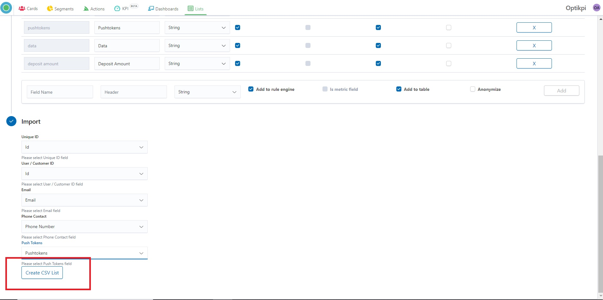


### Update <a id="Lists-Update.1"></a>

You can add Add CSV Data at your existing Acquisition List

I. From the Acquisition upper menu part go to the List where you want to add data and click the "Add CSV Data" button.

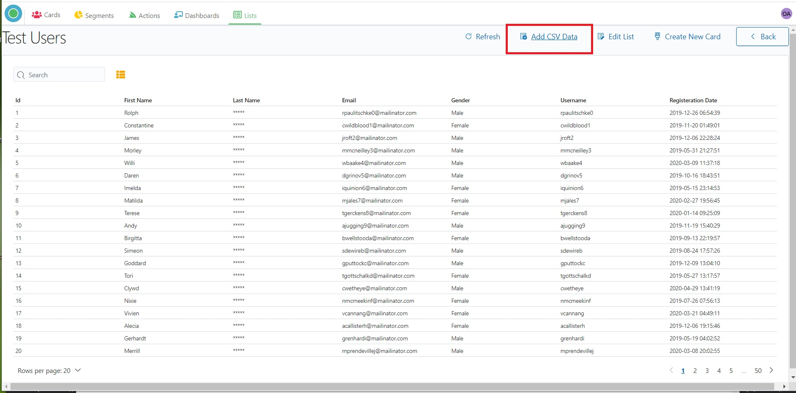

2. Select and Upload CSV file which has to have the same structure as an initial one.


3. You will see new data lines in the List.

### Delete <a id="Lists-Delete.1"></a>

Be careful!

List can be deleted only by the administrator.  
At this moment it is impossible to identify if the list is used in another Optikpi tool: cards, segments or actions.

If you delete a list that is using in another Optikpi tool you can break Cards or Segments or stop a Campaign.

I. You can delete any List by clicking on the “Trash” icon.


2. System will ask you “Do you really want to delete the List?”



When you confirm and press the “Delete” button the List will be deleted permanently, without the possibility of recovery.


### Data Types <a id="Lists-DataTypes"></a>

**String Data Type**

A string data type is a sequence of characters, either as a literal constant or as some kind of variable. The latter may allow its elements to be mutated and the length changed, or it may be fixed \(after creation\). A string is generally considered a data type and is often implemented as an array data structure of bytes \(or words\) that stores a sequence of elements, typically characters, using some character encoding.

**Boolean Data Type**

A Boolean data type has one of two possible values \(usually denoted true and false\), intended to represent the two truth values of logic and Boolean algebra. The Boolean data type is primarily associated with conditional statements, which allow different actions by changing control flow depending on whether a programmer-specified Boolean condition evaluates to true or false.

**Date Data Type**

The Date data type stores the calendar date.

**Float Data Type**

A floating-point data type uses a formulaic representation of real numbers as an approximation so as to support a trade-off between range and precision. For this reason, floating-point computation is often found in systems which include very small and very large real numbers, which require fast processing times. A number is, in general, represented approximately to a fixed number of significant digits and scaled using an exponent in some fixed base

**Integer Data Type**

An integer data type represents some range of mathematical integers. Integral data types may be of different sizes and may or may not be allowed to contain negative values. Integers are commonly represented in a computer as a group of binary digits \(bits\).

**Long Data Type**

The long data type is a 64-bit two’s complement integer.

### Add to Rule  <a id="Lists-AddtoRule"></a>

Clicking on the field **Add to rule engine** you can switch on/off of adding this data to your List.


You can add a column by providing data manually.

Provide Field Name, Header, choose the type of Data and press the “Add” button.


