# Optikpi User Guide : Segments

* [Create](optikpi-user-guide-segments.md#Segments-Create)
* [Download](optikpi-user-guide-segments.md#Segments-Download)
* [Add action to Segment](optikpi-user-guide-segments.md#Segments-AddactiontoSegment)
* [Edit](optikpi-user-guide-segments.md#Segments-Edit)
* [Clone](optikpi-user-guide-segments.md#Segments-Clone)
* [Delete](optikpi-user-guide-segments.md#Segments-Delete)

Segments are similar to Cards, represent Unique players. You create a segment by combining existing Cards to create higher level customer buckets.

## Create 

Go to the main Segment screen to start working with Segments.

I. Start creating a Segment pressing the "Create Segment" button From the "Segments" home screen.

2\. Provide a meaningful name for your Segment.

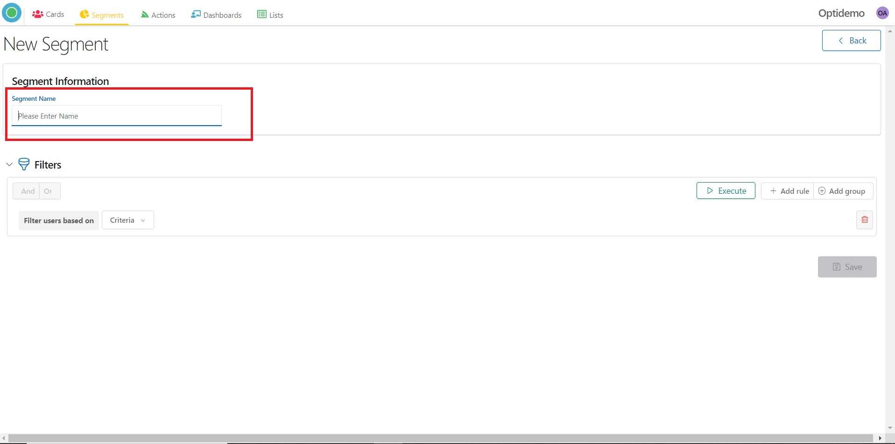

3\. Add criteria for your Segment at the “Filters” section.

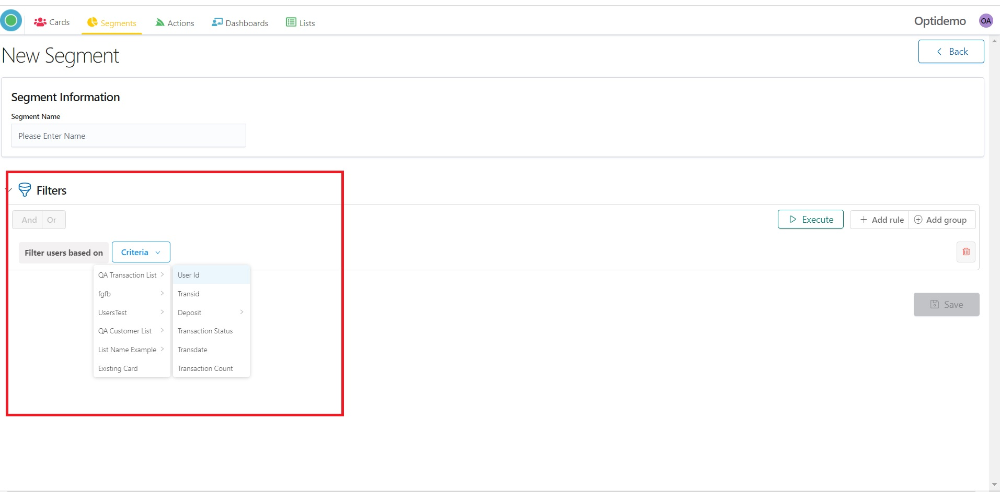

4\. Clicking on “Add rule” you can add more criteria.

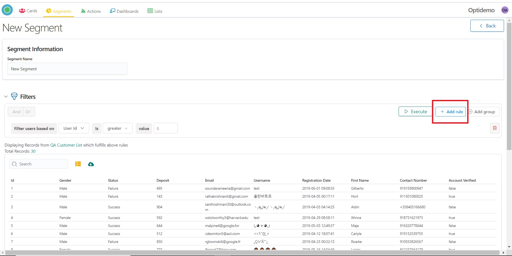

5\. You can select the "Cards" you wanted to combine for the Segment.

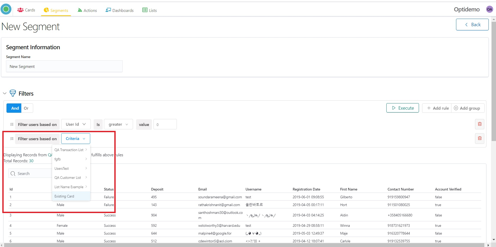

6\. After selecting the cards, press the "Execute" button.

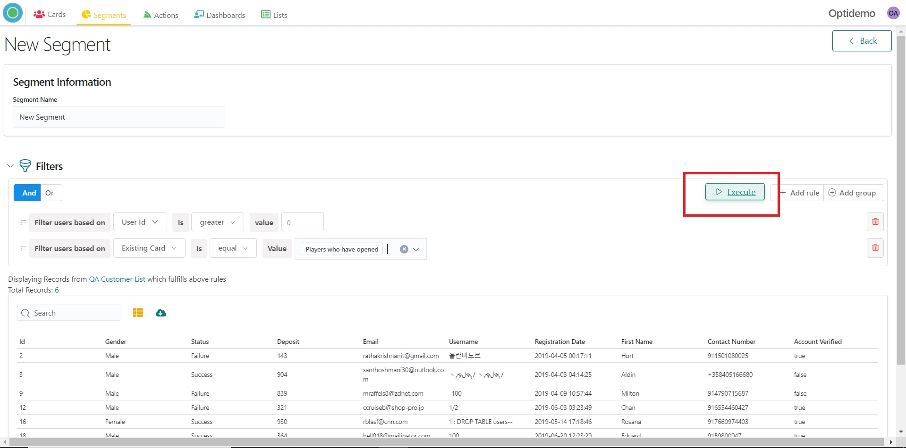

7\. Customers matching those selection criteria will be displayed in the table below.

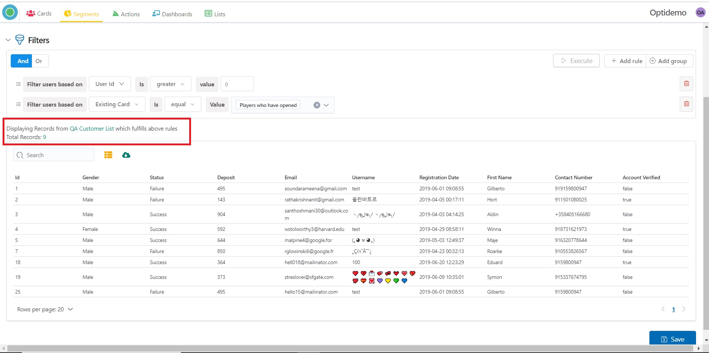

8\. Save your newly created Segment with a name, so we can use to trigger Actions on it.

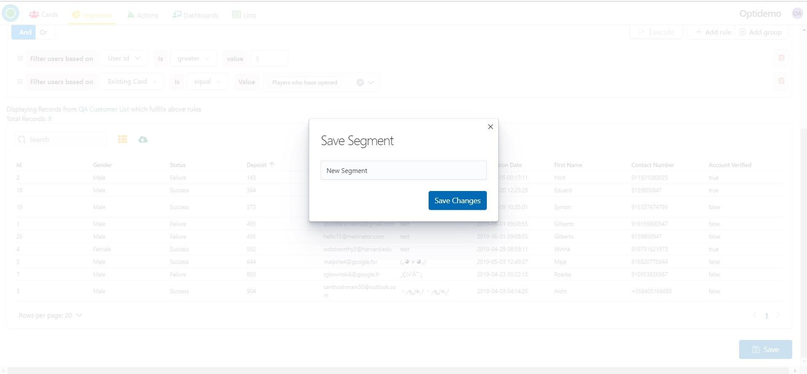

9\. You can see the new Segment from the "Segments" home screen.

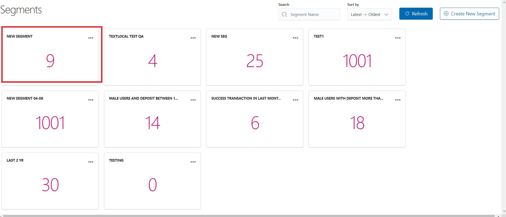

10\. Or before saving you can work with a Segment. Set your own Column Setting by choosing Available Fields.

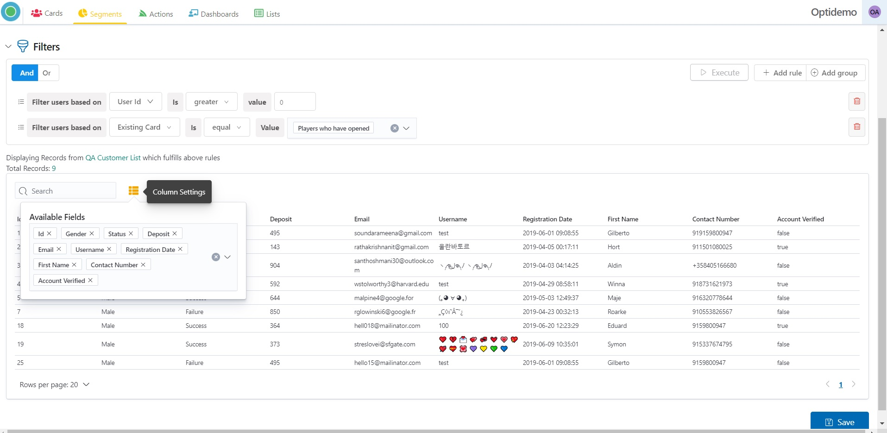

11\. You can download data in CSV format.

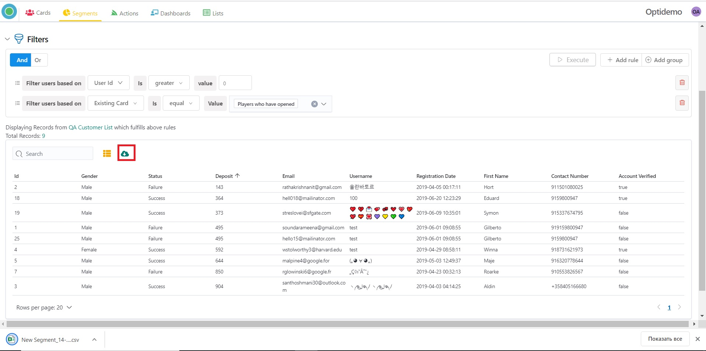

12\. You can sort data in ascending or descending order.

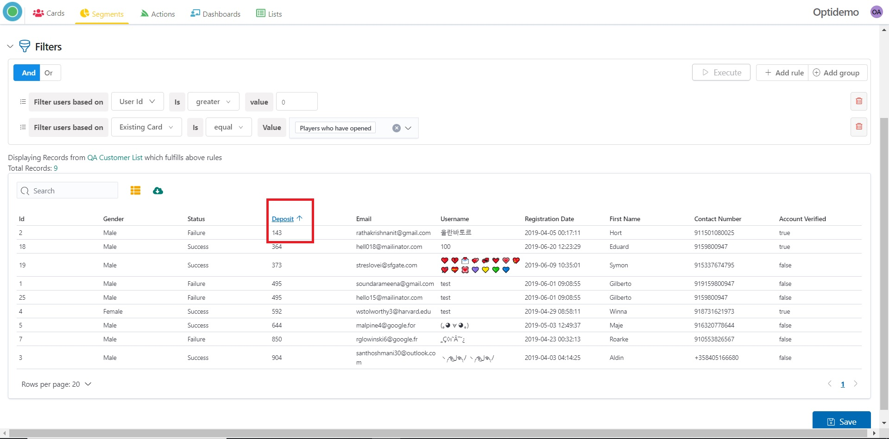

13\. Save your newly created Segment with a name, so we can use to start Actions on it.

## Download 

Optikpi gives the opportunity to download data in CSV format from your Segment.

I. By Clicking on 3 dots on Segment panel, a popup with comes up.

2\. Click **Table View** to see which data contains your Segment.

3\. Set your own Column Setting by choosing Available Fields.

4\. You can download data in CSV format.

5\. You can sort data in ascending or descending order.

## Add action to Segment 

By Clicking on 3 dots on the Segment panel, a popup with comes up. **Add Action** links you to the Confirmation panel where you can select the type of action and the channel for the action.

## Edit 

By Clicking on 3 dots on Segment panel, a popup with comes up. **Edit** allows changing Segment Information, criteria of the Segment.

## Clone 

By Clicking on 3 dots on the Segment panel, a popup with comes up. **Clone** allows creating an identical Segment.

## Delete 

By Clicking on 3 dots on the Segment panel, a popup with comes up. **Delete** allows delete Segment.

