# Optikpi User Guide : Segments

* [Create](optikpi-user-guide-segments.md#segments-create)
* [Download](optikpi-user-guide-segments.md#segments-download)
* [Add action to Segment](optikpi-user-guide-segments.md#segments-addactiontosegment)
* [Edit](optikpi-user-guide-segments.md#segments-edit)
* [Clone](optikpi-user-guide-segments.md#segments-clone)
* [Delete](optikpi-user-guide-segments.md#segments-delete)
* [Inactivate Segment](optikpi-user-guide-segments.md#inactivate-segment)

Segments represent unique players of given Lists based on different criterias. Segments can be bounded to several Retention Lists.

Use segments to create higher level customer buckets.

## Create 

Go to the main Segments screen to start working with Segments.

I. Start creating a Segment pressing the "Create Segment" button From the "Segments" home screen panel .

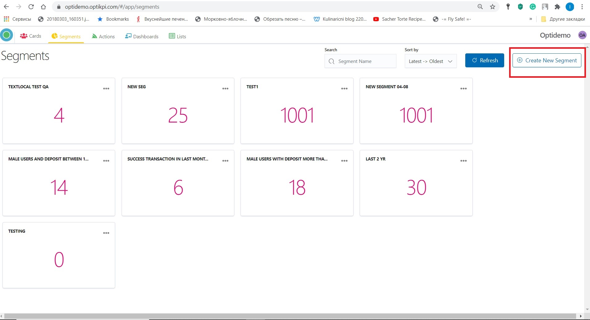

2\. Provide a meaningful name for your Segment.

.png>)

3\. Add criteria for your Segment at the “Filters” section.

4\. By clicking on the “Add rule” button you can add more criteria.

.png>)

5\. By clicking .png>) you can add more criteria based on the same List.

.png>)

6\. After settings all rules, press the "Execute" button.

.png>)

7\. Customers matching those selection criteria will be displayed in the table below.

.png>)

8\. Save your newly created Segment.

.png>)

9\. You will see the new Segment from the "Segments" home screen.

.png>)

## Download 

Optikpi gives the opportunity to download data in CSV format from your Segment.

I. By Clicking on 3 dots on Segment panel, a popup with comes up.

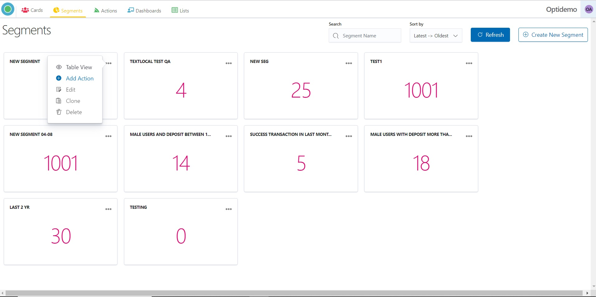

2\. Click **Table View** to see which data contains your Segment.

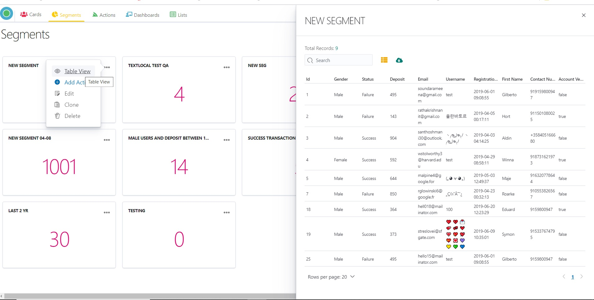

3\. Set your own Column Setting by choosing Available Fields.

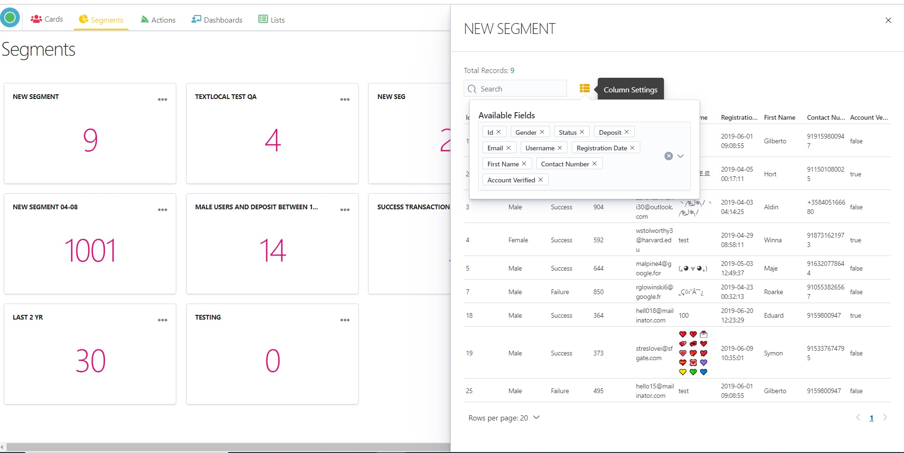

4\. You can download data in CSV format.

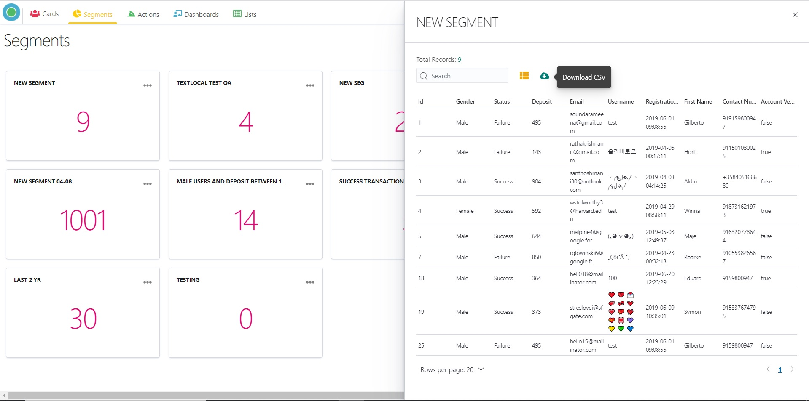

5\. You can sort data in ascending or descending order.

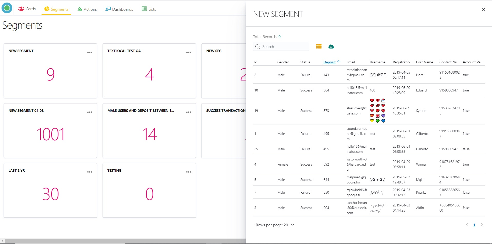

## Add action to Segment 

By Clicking on 3 dots on the Segment panel, a popup with comes up. **Add Action** links you to the Confirmation panel where you can select the type of action and the channel for the action.

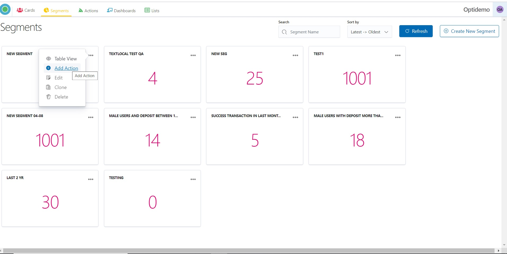

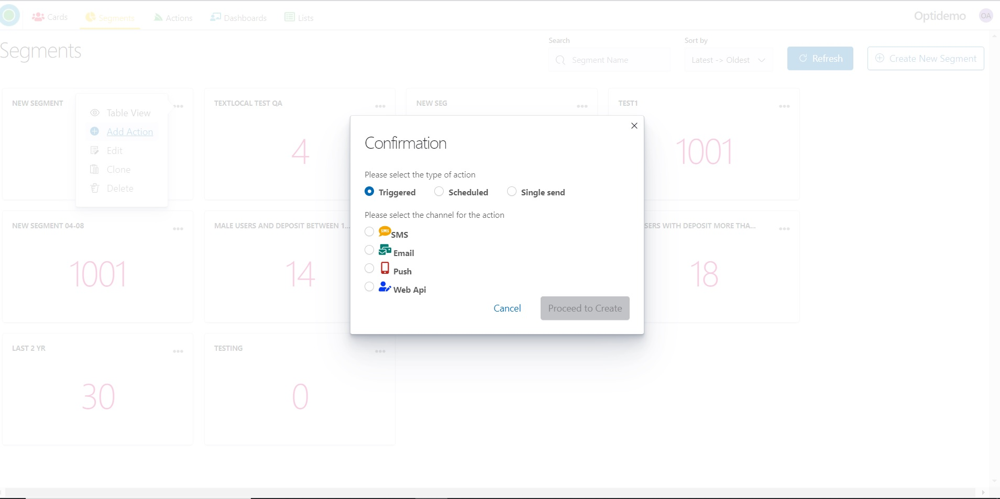

## Edit 

By Clicking on 3 dots on Segment panel, a popup with comes up. **Edit** allows changing Segment Information, criteria of the Segment.

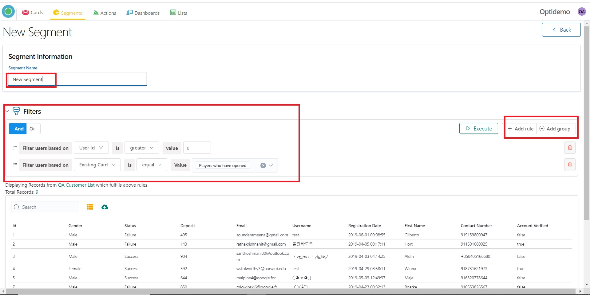

## Clone 

By Clicking on 3 dots on the Segment panel, a popup with comes up. **Clone** allows creating an identical Segment.

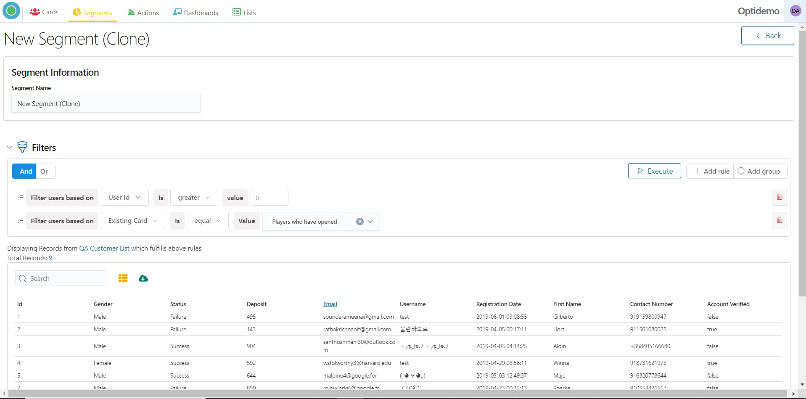

## Delete 

By Clicking on 3 dots on the Segment panel, a popup with comes up. **Delete** allows delete Segment.

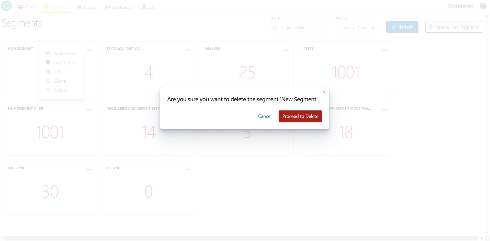

## Inactivate Segment

**Any newly created Segment is active by default.**&#x20;

There is a feature to **deactivate Segments**.&#x20;

_**Deactivated Segments are not available in the Dashboards.**_&#x20;

_**Deactivated Segments are not available for Actions creation.**_

**How to deactivate Segments.**

1. Getting start with the Segment main screen.

Check if your page is in the Card View Mode.

.png>)

2\. The activation toggle switcher is located in the in the lower right corner of the segment card.

.png>)

3\. For state changing of the Segment click on the Toggle once.

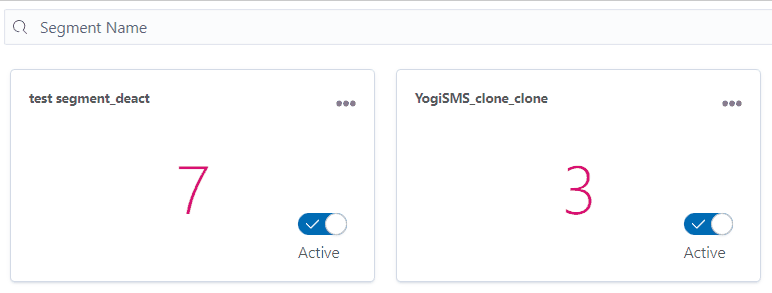

_**Deactivated Segments are not available in the Dashboards.**_&#x20;

_**Deactivated Segments are not available for Actions creation.**_

