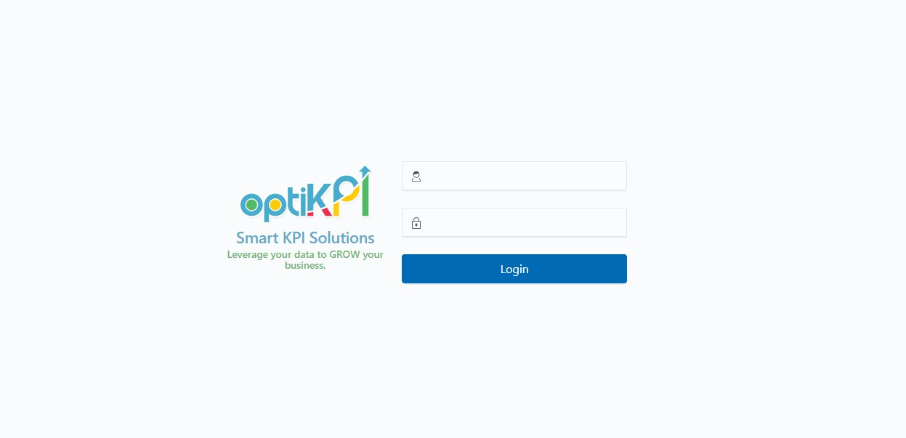

# Optikpi User Guide : Start working with Optikpi

Here are some tips to get you started work with the Optikpi system. 

1. To start working with Optikpi use a web browser, go to `https://<your subdomain>.optikpi.com` or the URL provided by the administrator.
2. Give your username and then enter your password.

A username may be case-sensitive when entered. If your Caps Lock key is enabled, try turning it off to enter your username in all lowercase.

