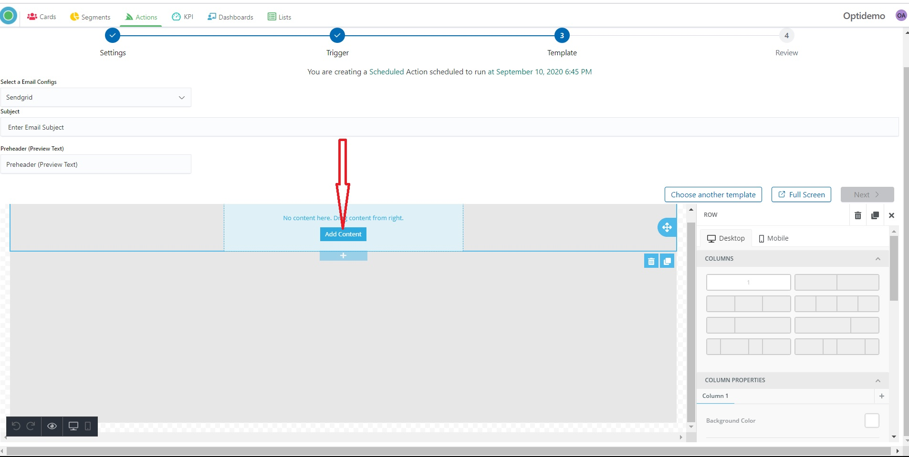
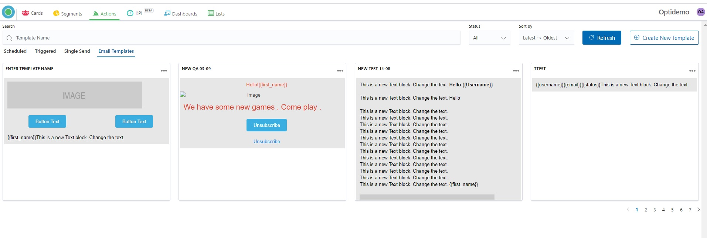
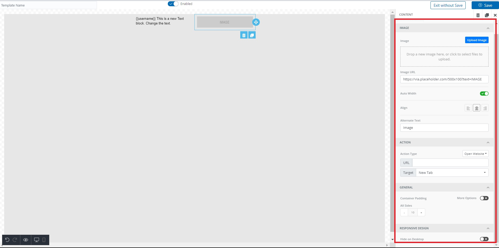

# Optikpi User Guide : Templates

* [Create New Templates while Email action creation](optikpi-user-guide-templates.md#Templates-CreateNewTemplateswhileEmailactioncreation)
* [Create New Templates](optikpi-user-guide-templates.md#Templates-CreateNewTemplates)
* [Edit](optikpi-user-guide-templates.md#Templates-Edit)
* [Clone](optikpi-user-guide-templates.md#Templates-Clone)
* [Delete](optikpi-user-guide-templates.md#Templates-Delete)

## Create New Templates while Email action creation 

I. Start creating an Email Notification by pressing the "Create New Action" button From the "Actions" home screen.

.jpg>)

&#x20;2\. Select an action type by choosing “Email Actions”.

3\. Provide Action’s Name and take action setting according to action’s type (**triggered,** **recurring** or **single send** action).

4\. After setting criteria click the “Execute” button.

5\. Select an **Email Configs** - your Email sending provider.

6\. Enter email **Subject.**

7\. Enter **Preheader**. (Preview Text).

A preheader is the short summary text that follows the subject line when an email is viewed in the inbox. Many mobile, desktop, and web email clients provide them to tip you off on what the email contains before you open it.

.jpg>)

8\. Create a new Template of your mail message by clicking on the “Create New Template” button.

If Template Disabled you will not see it while Email action creation

9\. Start creating your Templates by clicking on blue space.

10\. Drag content from the right-side panel.

&#x20;11\. In the text content, you can personalize the text content by adding relevant merge tags.

12\. Use a small black panel for preview how your Template looks on different devices.

13\. Press the “Next” button for the next step.

14\. System will offer you to save the current Email Template. Enter the Name and press “Next”. Or “Skip Save” if you don’t need saving.

15\. Check **Action Name, Selected Configs, Action Type, Rule, Template, Start and End Date.**

16\. In the case if you need to change something you can go back to the previous steps by clicking the corresponding steps on the top.

.jpg>)

17\. If everything is fine click to the "Save and Launch" button - in case if you want to save and launch your campaign or "Save" in case if you want just to save one.

.jpg>)

18\. "Save and Launch" means that your campaign will be started according to your settings. Your Action has “Active” status and in several minutes you will see the data and Action Tracking.

19\. "Save" means that your campaign will be saved with an “Inactive” status. You can change status and launch Action at any time.

.jpg>)

* [Create New Templates while Email action creation](optikpi-user-guide-templates.md#Templates-CreateNewTemplateswhileEmailactioncreation)
* [Create New Templates](optikpi-user-guide-templates.md#Templates-CreateNewTemplates)
* [Edit](optikpi-user-guide-templates.md#Templates-Edit)
* [Clone](optikpi-user-guide-templates.md#Templates-Clone)
* [Delete](optikpi-user-guide-templates.md#Templates-Delete)

## Create New Templates 

**This tutorial video will help you to Create a New Templates**

Tutorial 1. How to create a New Template directly in Optikpi  [https://www.youtube.com/watch?v=E1CfB8uF3YI](https://www.youtube.com/watch?v=E1CfB8uF3YI)

Tutorial 2. How to create a New Template using HTML code [https://www.youtube.com/watch?v=mhgbBABITdU](https://www.youtube.com/watch?v=mhgbBABITdU)

****

I. Start creating a new Template by pressing the "Create New Template" button from the "Actions" - “Email Templates” home screen.

2\. Start of creating of your Templates by clicking on blue space.

3\. Drag content from the right-side panel.

 (1).png>)

4\. In the text content, you can personalize the text content by adding relevant merge tags.

5\. Drop a new image here, or click to select files to upload.

6\. Or you can insert the **Image URL**

7\. Use the right-side panel to operate the visibility of your email on different devices.

8\. Use a small black panel to preview how your Template looks in different devices.

9\. You can add HTML-code to your Templates - copy it to your clipboard (from the HTML-file or from the Provider’s side).

.jpg>)

10\. In your Template open HTML viewer by drugging the “HTML” tool from the right-side panel.

11\. Paste the HTML snippet you just copied into your HTML viewer window.

.png>)

12\. Press the “save” button

13\. Provide the name for your Email Template.

14\. You will see your Template on the main home screen.

.png>)

* [Create New Templates while Email action creation](optikpi-user-guide-templates.md#Templates-CreateNewTemplateswhileEmailactioncreation)
* [Create New Templates](optikpi-user-guide-templates.md#Templates-CreateNewTemplates)
* [Edit](optikpi-user-guide-templates.md#Templates-Edit)
* [Clone](optikpi-user-guide-templates.md#Templates-Clone)
* [Delete](optikpi-user-guide-templates.md#Templates-Delete)

## Edit 

I. Start editing Template by by clicking on 3 dots on the Action - Email Templates panel, a popup with comes up. Click the “Edit” button

.jpg>)

2\. Switch on/off button allows Enable/Disable your Template.

If Template Disabled you will not see it while Email action creation

3\. Click the “Update” button

\

* [Create New Templates while Email action creation](optikpi-user-guide-templates.md#Templates-CreateNewTemplateswhileEmailactioncreation)
* [Create New Templates](optikpi-user-guide-templates.md#Templates-CreateNewTemplates)
* [Edit](optikpi-user-guide-templates.md#Templates-Edit)
* [Clone](optikpi-user-guide-templates.md#Templates-Clone)
* [Delete](optikpi-user-guide-templates.md#Templates-Delete)

## Clone 

Optikpi has a "clone" feature which allows you to create absolutely the same tool with the same setting criteria and database.

I. Start cloning Template by clicking on 3 dots on the Action - Email Templates panel, a popup with comes up. Click the “Clone” button.

.png>)

.png>)

* [Create New Templates while Email action creation](optikpi-user-guide-templates.md#Templates-CreateNewTemplateswhileEmailactioncreation)
* [Create New Templates](optikpi-user-guide-templates.md#Templates-CreateNewTemplates)
* [Edit](optikpi-user-guide-templates.md#Templates-Edit)
* [Clone](optikpi-user-guide-templates.md#Templates-Clone)
* [Delete](optikpi-user-guide-templates.md#Templates-Delete)

## Delete 

I. Start deleting Template by clicking on 3 dots on the Action - Email Templates panel, a popup with comes up. Click the “Delete” button.

2\. Press “Proceed to Delete” to finish.

* [Create New Templates while Email action creation](optikpi-user-guide-templates.md#Templates-CreateNewTemplateswhileEmailactioncreation)
* [Create New Templates](optikpi-user-guide-templates.md#Templates-CreateNewTemplates)
* [Edit](optikpi-user-guide-templates.md#Templates-Edit)
* [Clone](optikpi-user-guide-templates.md#Templates-Clone)
* [Delete](optikpi-user-guide-templates.md#Templates-Delete)
