# Optikpi User Guide : User management

* [Create New User](optikpi-user-guide-user-management.md#Usermanagement-CreateNewUser)
* [Edit permissions](optikpi-user-guide-user-management.md#Usermanagement-Editpermissions)
* [Delete User](optikpi-user-guide-user-management.md#Usermanagement-DeleteUser)

## Create New User 

1. Start Admin configuration by pressing the "OptiKPI Admin" button on Up Right Side.

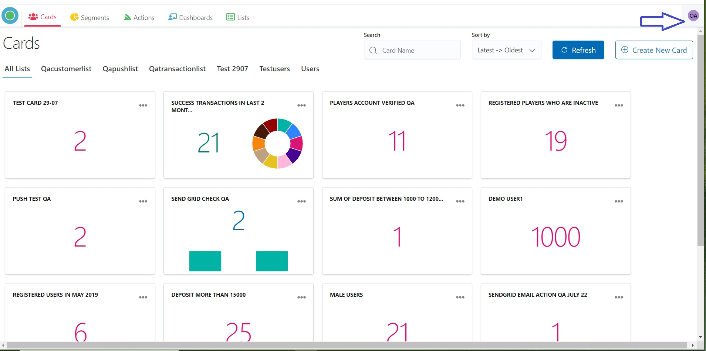

.png>)

2\. Go ahead by pressing the "Admin Settings" icon.

.jpg>)

3\. Choose the “Users” tub in the Up Panel and then press the "Create User" button.

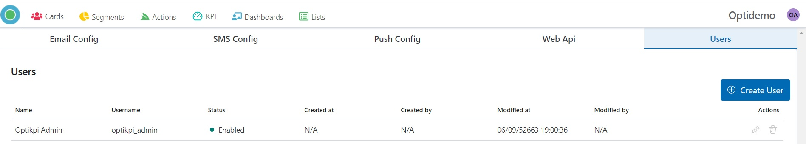

4\. Provide: Name - Real user’s name, and Username.

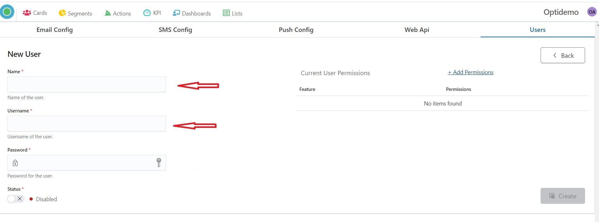

5\. Create Password.

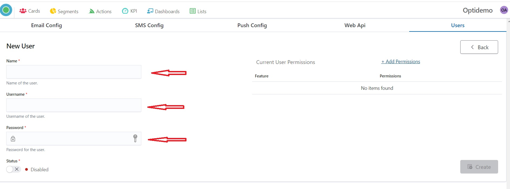

6\. Change Staus for Enabled

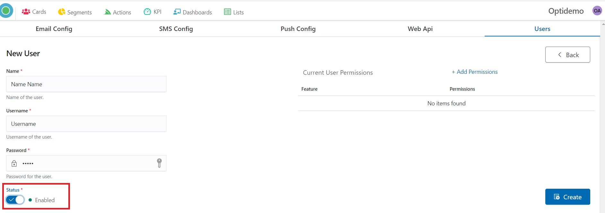

7\. Set User Permission by clicking the “Add Permissions” button.

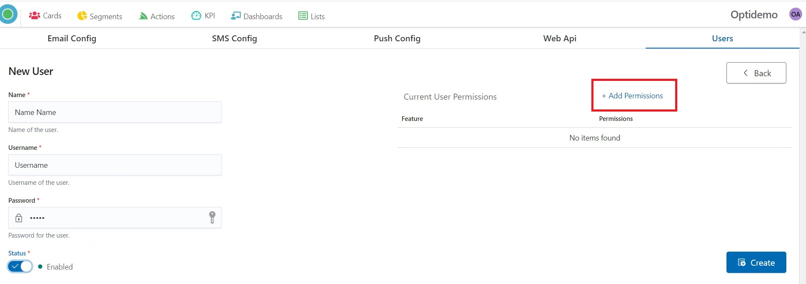

8\. Choose what the user can access by clicking on the “Enable” green button.

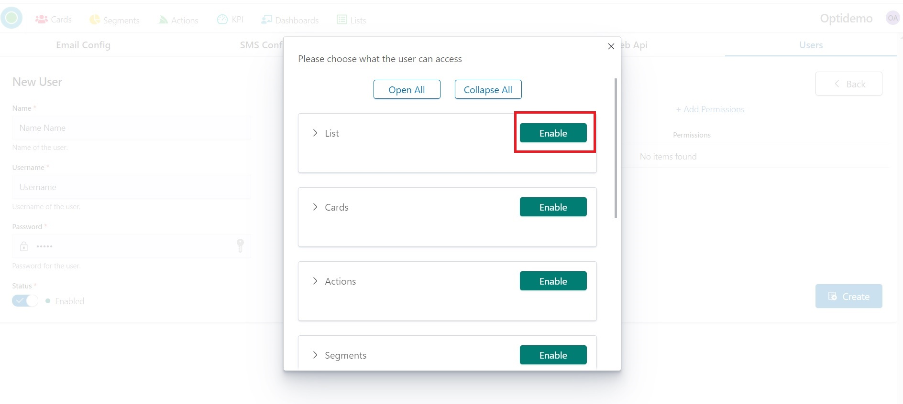

9\. Marck what User can do.

We strongly recommend that you don't give users the ability to delete Lists.\
This level of access is better left only for the administrator.

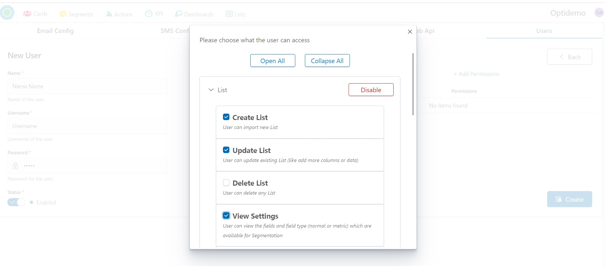

10\. Press the “X” sign to see User permissions.

.jpg>)

&#x20;11\. Press the “Create” button for the ending.

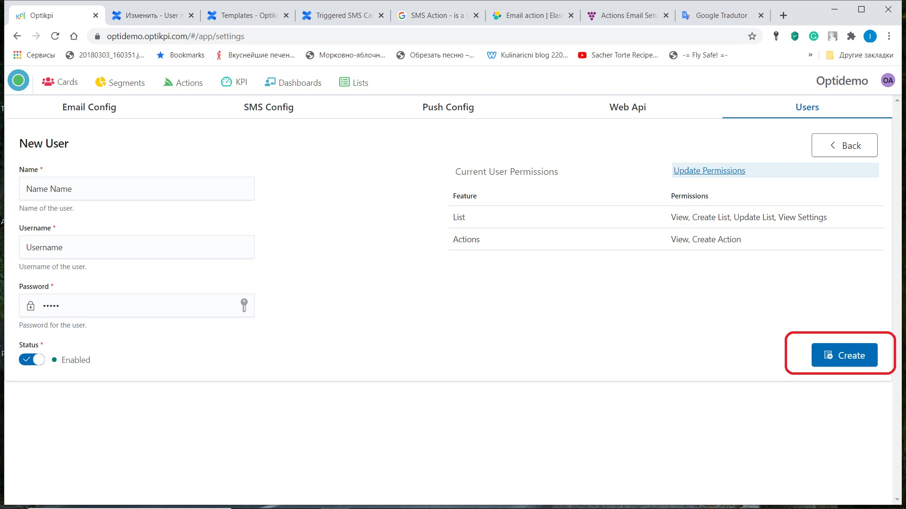

* [Create New User](optikpi-user-guide-user-management.md#Usermanagement-CreateNewUser)
* [Edit permissions](optikpi-user-guide-user-management.md#Usermanagement-Editpermissions)
* [Delete User](optikpi-user-guide-user-management.md#Usermanagement-DeleteUser)

## Edit permissions 

1. Start Admin configuration by pressing the "OptiKPI Admin" button on Up Right Side.

 (2).png>)

2\. Go ahead by pressing the "Admin Settings" icon.

.jpg>)

3\. Choose the “Users” tub on the Up Panel.

4\. Find the line with the needed User and click on the pencil icon

5\. Press the “Update Permission” button for updating permissions.

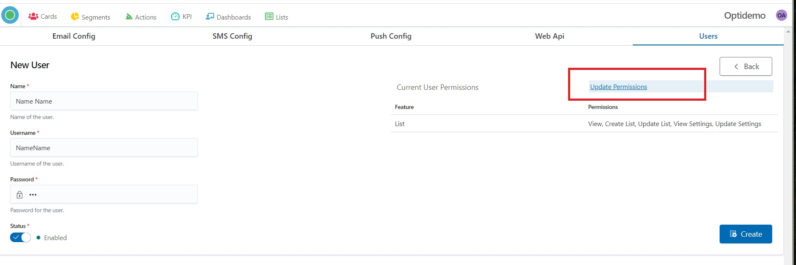

6\. Press “Create” for ending.

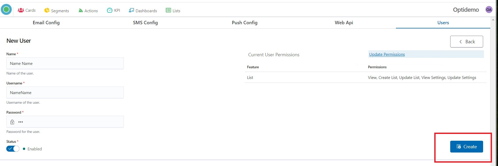

* [Create New User](optikpi-user-guide-user-management.md#Usermanagement-CreateNewUser)
* [Edit permissions](optikpi-user-guide-user-management.md#Usermanagement-Editpermissions)
* [Delete User](optikpi-user-guide-user-management.md#Usermanagement-DeleteUser)

## Delete User 

1.  Start Admin configuration by pressing the "OptiKPI Admin" button on Up Right Side.

.jpg>)

2\. Go ahead by pressing the "Admin Settings" icon.

.jpg>)

3\. Choose the “Users” tub in the Up Panel.

4\. Find the line with the needed User and click on the trash icon

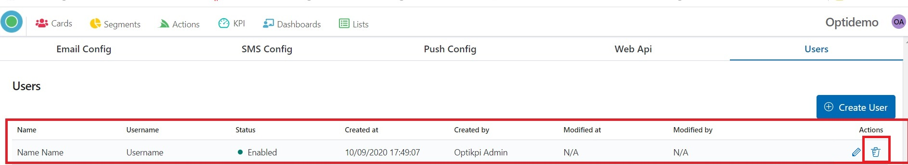

5\. Press “Delete” for ending.

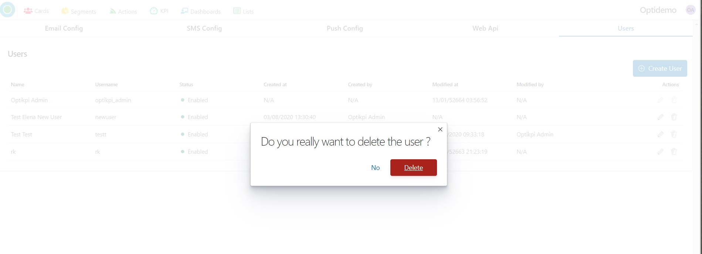

* [Create New User](optikpi-user-guide-user-management.md#Usermanagement-CreateNewUser)
* [Edit permissions](optikpi-user-guide-user-management.md#Usermanagement-Editpermissions)
* [Delete User](optikpi-user-guide-user-management.md#Usermanagement-DeleteUser)
